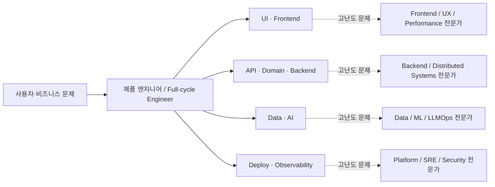
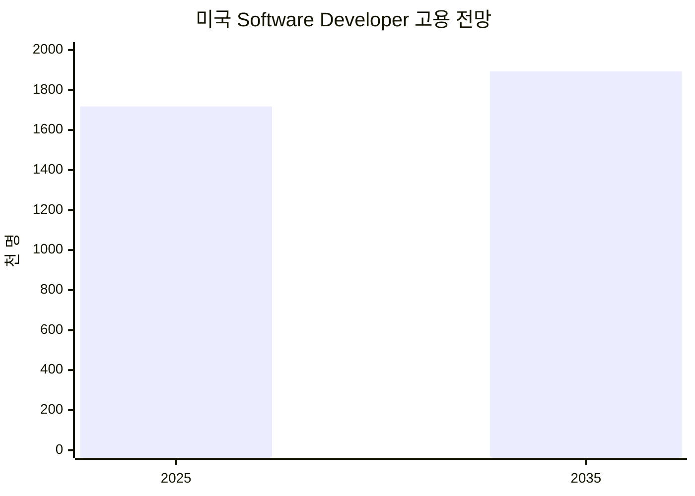
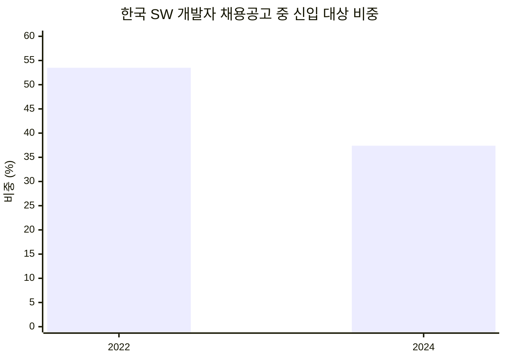
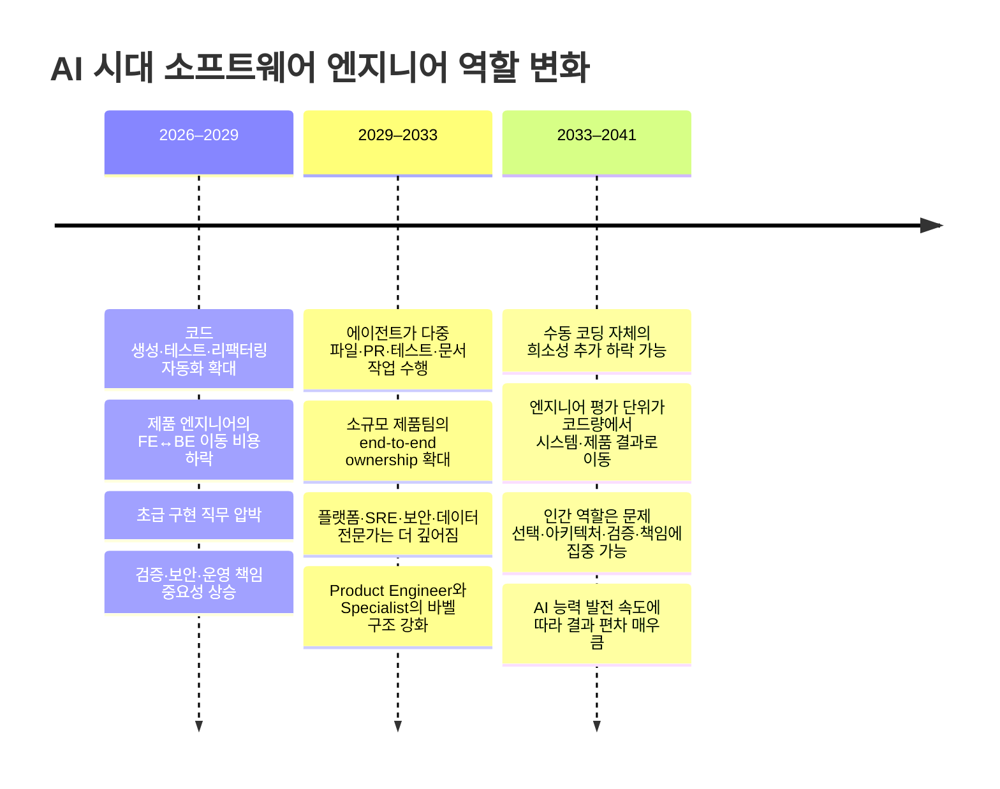

# AI가 소프트웨어 엔지니어링 직무를 어떻게 재편하는가: 프론트엔드·제품–백엔드 하이브리드 커리어의 장기 생존성

## 경영진 요약

**결론부터 말하면, 프론트엔드/제품 영역과 백엔드/서버 영역을 함께 수행하는 전략은 장기적으로 유효하다. 다만 “프론트엔드 전문가 + 백엔드 전문가라는 두 직업을 동시에 유지한다”는 전략은 비효율적이다. 더 강한 형태는 `깊은 기술 축 하나 + 제품 전체를 끝까지 소유할 수 있는 넓이 + AI를 통한 실행 레버리지`다.**

- **AI가 가장 빠르게 압축하는 것은 구현 노동이지, 제품 전체에 대한 책임은 아니다.** Microsoft·Accenture·Fortune 100 기업의 4,867명 개발자 무작위 실험에서는 AI 코딩 도구 사용 시 완료 작업량이 평균 26.08% 증가했지만, Stack Overflow 조사에서는 AI 정확성을 신뢰한다는 개발자보다 불신한다는 개발자가 더 많고, 배포·모니터링에는 AI를 쓰지 않겠다는 비율이 76%였다. 즉 코드 생성의 단가는 떨어지고 있지만 검증·운영·아키텍처 책임은 아직 압축되지 않았다. citeturn7search9turn6view0
- **따라서 프론트엔드와 백엔드의 경계는 “구현 레이어”에서는 약해지고, “전문성·책임 레이어”에서는 오히려 남는다.** 2026년 현재 Vercel의 채용 구조만 봐도 고객 문제부터 프론트엔드 마이그레이션·AI 애플리케이션·아키텍처까지 관통하는 Forward-Deployed Engineer가 존재하는 동시에 Backend, Compute, CDN, Security 등 깊은 전문 직무도 별도로 채용된다. 이것이 앞으로 가장 개연성 높은 조직 형태다. citeturn18search5turn18search25
- **가장 위험한 포지션은 “한 레이어의 정형화된 구현만 잘하는 개발자”다.** 한국노동연구원의 소프트웨어 개발자 고용 분석을 인용한 국내 보도에 따르면 개발자 채용공고에서 신입 대상 비중은 2022년 53.5%에서 2024년 37.4%로 크게 낮아졌다. 반면 미국 BLS는 소프트웨어 개발자 고용 자체는 2025~2035년 약 10% 증가할 것으로 전망한다. 이는 “개발자가 사라진다”기보다 **입문·정형 구현 업무의 진입문은 좁아지면서, 숙련된 엔지니어의 범위는 넓어지는 현상**과 더 잘 부합한다. citeturn11view0turn10search22turn10search6turn10search26turn5view0
- **장기적으로 유망한 정체성은 Full-stack보다 `Product Engineer / Full-cycle Engineer / Backend-anchored Product Engineer`에 가깝다.** 사용자 문제 → UI → API → 데이터 → 운영 → 관측성 → 피드백까지 소유하되, 분산 시스템·데이터·보안·프론트엔드 성능 등 최소 하나에서는 AI 결과를 심사할 수 있을 만큼 깊어야 한다. 한국 SPRi 역시 AI 인력을 직업명보다 기능·역량 중심으로 봐야 한다고 분석하며, AI 서비스 개발 역할에 DB·API·Frontend·Backend·QA·운영을 함께 포함한다. citeturn11view1
- **AI를 많이 쓰는 것 자체가 경쟁력이 아니다. AI가 만든 결과를 평가하고 생산 시스템에 안전하게 넣는 능력이 경쟁력이다.** DORA의 2025 연구에서는 AI가 조직의 강점과 약점을 증폭시키는 “amplifier”로 나타났으며, 높은 AI 활용은 처리량 증가와 동시에 불안정성 증가와도 연결됐다. METR의 2025 실험에서는 숙련 오픈소스 개발자가 오히려 19% 느려졌고, 2026 후속 데이터에서는 개선 신호가 나타났으나 선택 편향 때문에 정확한 효과를 추정할 수 없다고 연구진 스스로 경고했다. citeturn7search20turn7search26turn14view0turn16view0
- **권고:** 향후 2년 동안은 두 영역을 모두 버리지 말되 **50:50으로 공부하지 말라.** 한쪽을 60~70%의 깊은 앵커로 유지하고 나머지를 20~30%의 제품 실행 역량으로 확보하며, 나머지 10~20%를 AI·테스트·관측성·보안·제품 판단 능력에 배분하는 것이 가장 방어적인 전략이다. 이 비율은 연구 결과가 아니라 본 보고서가 위 증거를 바탕으로 제안하는 커리어 설계 원칙이다.

**핵심 판정**

| 전략 | 향후 1–3년 | 3–7년 | 7–15년 | 장기 평가 |
|---|---:|---:|---:|---|
| 프론트엔드 구현만 전문 | 보통 | 위험 상승 | 높은 불확실성 | △ |
| CRUD/API 중심 백엔드만 전문 | 보통 | 위험 상승 | 높은 불확실성 | △ |
| FE+BE를 얕게 모두 수행 | 강함 | 보통 | 약해질 가능성 | △ |
| **한 영역 심화 + 전체 제품 소유** | **매우 강함** | **매우 강함** | **가장 방어적** | **◎** |
| 인프라·DB·보안·분산시스템 등 심층 전문가 | 매우 강함 | 매우 강함 | 강함 | ◎ |
| **심층 기술 + 제품 전주기 + AI 오케스트레이션** | **최상** | **최상** | **가장 유력한 상위 IC 형태** | **◎◎** |

표의 중장기 평가는 BLS·WEF·DORA·Stack Overflow·SPRi 및 현재 채용 구조를 바탕으로 한 시나리오 분석이며, 특히 7–15년 구간은 예측 불확실성이 매우 높다. citeturn5view0turn6view1turn7search26turn6view0turn11view1


## 범위와 전제

질문의 “front-end (band?)”는 문맥상 **frontend 또는 product-facing engineering**으로 해석한다. 여기서 하이브리드 엔지니어는 단순히 React와 Spring/Go/Node를 모두 사용할 줄 아는 사람보다 더 넓은 의미다.

본 보고서에서 말하는 목표 역할은 대략 다음 범위를 가진다.

> **문제 정의·사용자 경험 → 프론트엔드 → API·도메인 모델 → 데이터 → 배포 → 관측성·운영 → 제품 지표를 하나의 흐름으로 이해하고, 최소 한 영역에서는 깊은 기술 판단을 할 수 있는 엔지니어**

이는 흔히 `Full-stack Engineer`, `Product Engineer`, `Product-minded Engineer`, `Full-cycle Engineer`, 일부 조직의 `Forward-Deployed Engineer` 등 여러 이름으로 나타난다. 명칭은 표준화되어 있지 않으며, 실제 업무 범위는 기업마다 크게 다르다. 현재 Vercel 같은 회사에서는 고객·제품·프론트엔드·AI 시스템을 횡단하는 역할과 Backend/Compute/Security 같은 전문 역할이 동일 조직 안에 병존한다. citeturn18search5turn18search25

**중요한 전제:** 정확한 연차, 산업, 현재 프론트엔드 숙련도는 주어지지 않았으므로 특정 기업·직급에 맞춘 조언이 아니라 일반적인 소프트웨어 IC(individual contributor)를 기준으로 한다. 또한 장기 전망은 AI 모델 능력, 규제, 자본 비용, 기업의 책임 구조가 크게 변할 수 있기 때문에 2033년 이후는 단일 예측이 아니라 시나리오로 취급한다. WEF 역시 2030년까지 현재 기술의 39%가 변하거나 낡을 것으로 보는 등 중기조차 상당한 기술 전환을 예상하고 있다. citeturn6view1

직무의 장기 생존성을 평가할 때 가장 중요한 구분은 **직업(job)과 작업(task)을 분리하는 것**이다. 생성형 AI가 코드 작성이라는 작업을 크게 자동화해도, 요구사항 판단·시스템 설계·품질 책임·배포·장애 대응·보안·사용자 문제 해결이 동시에 자동화된다는 뜻은 아니다. BLS가 묘사하는 소프트웨어 개발자의 업무도 사용자 요구 분석, 시스템 설계, 유지보수, 테스트, 문서화 및 이해관계자 협업까지 포함하며 단순 코딩보다 훨씬 넓다. citeturn5view0


## 역할 수렴과 분화: 미국·유럽·한국의 전문가 관점

현재 전문가 의견을 종합하면 “모든 개발자가 풀스택이 된다” 또는 “전문가만 살아남는다” 중 어느 한쪽보다는 **두 현상이 동시에 진행되는 바벨(barbell) 구조**가 더 설득력이 있다.

| 지역·관점 | 핵심 주장 | 하이브리드 엔지니어에 대한 함의 |
|---|---|---|
| 미국 — Bill Gates | AI가 개발 생산성을 크게 높이면 소프트웨어 비용이 낮아지고, 그 결과 소프트웨어 수요 자체가 더 커질 수 있다고 본다. citeturn2search11 | 구현 생산성 향상 → 한 엔지니어가 더 넓은 제품 범위를 담당할 경제적 유인 |
| 미국 — Microsoft 연구 | 4,867명 현장 실험에서 AI 코딩 보조가 완료 작업량을 평균 26.08% 늘렸고, 경험이 적은 개발자에서 효과가 더 컸다. citeturn7search9 | FE↔BE의 “낯선 레이어 진입 비용”이 낮아짐 |
| 유럽/영국 — Daniel Susskind | 자동화 시대에는 기존 직업명보다 해결할 문제 자체에 초점을 맞추라고 주장한다. citeturn13search18 | “frontend/backend”보다 제품 문제에 대한 end-to-end ownership이 중요 |
| 유럽/영국 — Simon Willison | LLM은 기존 전문성을 증폭하지만, 테스트·판단·인수 책임은 개발자에게 남는다고 강조한다. citeturn15view2turn15view5 | 폭은 AI로 넓힐 수 있지만 깊이가 없으면 AI 결과를 검증하기 어려움 |
| 한국 — SPRi | 빠르게 재조합되는 AI 직무는 기존 직업명보다 기능·역량 중심으로 분류해야 하며, AI 서비스 개발자 범위에 DB/API/Frontend/Backend/QA/운영 등이 포함된다. citeturn11view1 | 국내에서도 역할 경계보다 전체 서비스 구현 역량이 중요해지는 방향 |
| 한국 — 한국노동연구원 | 개발자 고용·직무 변화를 분석하며 특히 신입층과 숙련층의 시장 변화가 동일하지 않음을 보여준다. citeturn11view0turn10search22 | 범용적인 초급 구현력보다 경험·문맥·복합 역량 프리미엄 상승 가능성 |

전문가들의 표현은 서로 다르지만 상당히 일관된 메시지가 있다.

Bill Gates는 AI가 **“software developers at least twice as efficient”**하게 만들고 있다고 주장한다. 이 전망이 정확히 2배인지보다 중요한 것은 그의 경제적 논리다. 소프트웨어 생산비가 하락하면 개발자의 필요가 단순히 절반으로 줄어드는 것이 아니라 더 많은 소프트웨어가 만들어지는 수요 효과가 나타날 수 있다는 것이다. 이는 미국 BLS가 AI 확산에도 불구하고 소프트웨어 개발자 고용을 2035년까지 증가할 것으로 전망하는 것과 방향성이 맞는다. citeturn2search11turn5view0

영국 경제학자 Daniel Susskind는 2026년 커리어 조언에서 **“choose a profession because the problem interests you, not the job.”**이라고 표현했다. 직함 자체를 미래 보장 수단으로 보지 말라는 이야기다. 프론트엔드냐 백엔드냐보다 “고객 전환율을 개선한다”, “결제 신뢰성을 보장한다”, “검색 지연시간을 줄인다” 같은 문제 단위의 전문성이 더 이식 가능하다는 뜻으로 해석할 수 있다. citeturn13search18

영국의 소프트웨어 엔지니어 Simon Willison의 실전 관점은 한층 보수적이다. 그는 LLM으로 프로토타입을 빠르게 만들고 실제 기능을 수십 분 안에 배포하는 사례를 보여주면서도 **“Your responsibility as a software developer is to deliver working systems.”**라고 강조한다. 또한 그의 생산성은 25년 이상의 경험에 크게 의존했다고 명시한다. 즉 AI는 초보자를 곧바로 시니어 풀스택 엔지니어로 만들어 주기보다는 **이미 가진 시스템 모델을 더 넓은 영역에 적용할 수 있게 하는 레버리지**에 가깝다. citeturn15view2turn15view5

한국 SPRi의 분석도 이와 흥미롭게 일치한다. 해당 연구는 생성형 AI·에이전트 시대의 직무가 기존 직업분류보다 빠르게 재조합되고 있어 **직업명 대신 업무 기능과 역량 요소를 봐야 한다**고 보고, AI 서비스 개발 역할을 UI/UX·API·DB·Frontend·Backend·QA·운영까지 아우르는 형태로 기술한다. 동시에 LLMOps, RAG 엔지니어, AI 모델 평가·검증, AI 거버넌스 같은 새로운 전문 분야가 생기고 있다고 본다. 즉 한국에서도 **수렴과 새로운 전문화가 동시에 발생**하는 구조다. citeturn11view1

이들을 종합하면 향후 엔지니어 조직은 다음과 같은 형태가 가장 개연성이 높다.



**핵심은 모든 사람이 모든 분야의 전문가가 되는 것이 아니다.** 제품 팀의 일반 엔지니어가 더 넓은 영역을 직접 처리하게 되고, 그 바깥에는 더 깊어진 플랫폼·인프라·보안·성능 전문가가 존재하는 구조다. Vercel의 현재 채용 포트폴리오가 이미 이 패턴을 상당 부분 보여준다. citeturn18search5turn18search25


## 데이터가 보여주는 실제 변화

AI 코딩의 생산성 효과를 이야기할 때 가장 큰 오류는 하나의 숫자를 전체 소프트웨어 엔지니어링에 적용하는 것이다. 현재 실증 연구는 **긍정적이면서 동시에 서로 모순돼 보이는 결과**를 내놓고 있는데, 실제로는 서로 다른 업무를 측정하고 있다.

| 근거 | 표본·맥락 | 결과 | 이 보고서의 해석 |
|---|---|---|---|
| Microsoft Research 2025 | Microsoft·Accenture·Fortune 100, 개발자 4,867명, 현장 RCT | AI 보조 사용 시 완료 작업 +26.08%; 저경력층 효과가 더 큼 citeturn7search9 | 잘 정의된 구현 작업은 빠르게 압축됨 |
| DORA 2025/2026 분석 | 대규모 기술 전문가 조사 + Google 엔지니어 1,110개 정성 응답 | AI 사용 매우 보편화; 초기 코드 생성은 빨라지나 검증 업무가 증가하고, AI 활용은 처리량과 불안정성을 함께 증폭 가능 citeturn7search20turn7search26 | 병목이 typing에서 validation/integration으로 이동 |
| METR 2025 | 숙련 OSS 개발자 16명, 실제 이슈 246개 | AI 사용 시 오히려 완료 시간 19% 증가; 본인들은 빨라졌다고 인식 citeturn14view0 | 익숙하고 복잡한 코드베이스에서는 AI 오버헤드가 클 수 있음 |
| METR 2026 후속 | 57명, 143 저장소, 800+ task | 후기 모델에서 개선 신호가 있으나 강한 선택편향으로 정확한 효과 추정 불가 citeturn16view0 | AI 효과가 빠르게 변하고 있어 고정 수치에 베팅하면 위험 |
| Stack Overflow 2025 | 글로벌 개발자 조사 | 84%가 AI 도구 사용/사용 계획; 정확성은 46% 불신 vs 33% 신뢰; 배포·모니터링은 76%가 AI 사용 계획 없음 citeturn6view0 | 코드 생성과 production responsibility 사이의 격차가 큼 |

특히 METR 연구는 중요한 반례다. 2025년 초 연구에서 참가자는 평균 수년간 직접 기여한 대형 오픈소스 저장소를 대상으로 실제 버그·기능·리팩터링을 수행했다. AI를 허용한 경우 **19% 더 오래 걸렸지만**, 실험 전에는 24% 빨라질 것으로 예상했고 실험 후에도 자신이 약 20% 빨라졌다고 생각했다. 즉 AI의 “체감 생산성”은 실제 생산성과 크게 다를 수 있다. citeturn14view0

그러나 이 결과 역시 “AI가 개발자를 느리게 한다”는 일반화로 사용할 수 없다. METR은 2026년 후속 연구에서 참여자들이 AI 없는 조건을 거부하기 시작했고 일부는 AI가 크게 유리한 업무를 아예 실험에 제출하지 않는 선택 편향이 발생했다고 보고했다. 원래 참가자 일부에서는 후기 도구 사용 시 약 18% 단축 방향의 추정치까지 나타났지만 신뢰구간이 넓었고 연구진은 이를 신뢰할 만한 중앙 추정치로 보지 않았다. citeturn16view0

이 점은 커리어 전략에 매우 중요하다. **AI 역량을 무시하는 것도 잘못이고, AI가 곧 모든 구현을 완전히 자동화한다고 가정하는 것도 현재 증거보다 훨씬 강한 주장**이다.

DORA의 최신 분석에서는 AI가 초기 코드 작성 시간을 줄이지만 그 절약분 중 상당 부분이 감사·검증으로 이동한다. 한 Google 엔지니어는 다음과 같이 표현했다.

> “AI tools increase my productivity … but the code is (currently) lower quality than I could write myself.” citeturn7search26

DORA가 관찰한 핵심은 **AI가 조직의 소프트웨어 전달 시스템을 대체하기보다 증폭한다는 것**이다. 좋은 테스트·API·내부 플랫폼·자동화·관측성이 갖춰진 조직에서는 AI가 더 큰 이득을 만들지만, 취약한 시스템에서는 기술 부채와 불안정성을 더 빠르게 생성할 수 있다. citeturn7search20turn7search26

역할별로 보면 따라서 다음과 같이 해석하는 것이 타당하다.

| 업무 영역 | AI가 줄이는 비용 | 여전히 중요한 인간 역량 | 하이브리드 전략의 가치 |
|---|---|---|---|
| UI 컴포넌트·화면 구현 | boilerplate, CSS/JS 초안, 반복 작업 | UX 판단, 접근성, 브라우저 동작, 성능, 디자인 시스템 | 높음 |
| 제품 프로토타입 | scaffolding, mock, 빠른 iteration | 어떤 문제를 풀지, 사용자 피드백 해석 | **매우 높음** |
| CRUD/API | endpoint·DTO·테스트 초안 | 도메인 invariant, 계약 설계, 인증·인가 | 높음 |
| DB·데이터 | SQL·migration 초안 | 데이터 모델, 일관성, lock/index, 복구 | 중간~높음 |
| 분산시스템 | 코드·문서 탐색 | 장애 모드, 일관성, capacity, trade-off | 깊은 전문성 우위 |
| 테스트 | test case 생성 | 무엇을 검증해야 하는지, oracle·invariant 정의 | **매우 높음** |
| 배포·SRE | runbook·설정 초안 | production 판단, blast radius, incident 대응 | 깊은 전문성 우위 |
| 보안 | 패턴·스캔·코드 보조 | threat model, 권한 경계, 공급망·규제 | 깊은 전문성 우위 |
| 제품 의사결정 | 분석·아이디어 생성 | 우선순위, 비용/가치 판단, 책임 | **매우 높음** |

이 평가는 Stack Overflow의 사용 행태, DORA의 품질·운영 결과, Microsoft/METR 생산성 실험과 SPRi의 역할 분류를 종합한 질적 판단이다. citeturn6view0turn7search9turn7search26turn14view0turn11view1

채용시장 역시 “전체 개발자 수 감소”라는 단순한 그림을 보이지 않는다. 미국 BLS는 Software Developers 직군을 2025년 약 171.78만 명에서 2035년 약 189.26만 명으로 전망하며 약 17.47만 명, 10% 증가를 예상한다. AI·IoT·로보틱스·자동화·보안 수요가 성장 요인으로 언급된다. citeturn5view0



반면 한국에서는 **진입층의 압력**이 더 뚜렷하다. 한국노동연구원 보고서를 인용한 국내 보도에 따르면 소프트웨어 개발자 채용공고에서 신입 대상 비중은 2022년 53.5%에서 2024년 37.4%로 16.1%p 감소했다. 같은 분석에서 2024년 3년 미만 경력 개발자는 전년 대비 약 9천 명 감소한 반면 3년 이상은 약 4만2천 명 증가한 것으로 보도됐다. 원 보고서의 존재·주제는 한국노동연구원에서 확인되며, 아래 세부 수치는 해당 보고서를 인용한 복수 국내 보도를 기준으로 한다. citeturn11view0turn10search22turn10search6turn10search26



이 두 그래프를 함께 읽는 것이 중요하다. **소프트웨어 엔지니어에 대한 총수요는 유지·증가하면서 초급·정형 업무의 가치만 감소하는 시장**은 충분히 가능하다. WEF 역시 Software and Application Developers를 2030년까지 빠르게 성장할 직군 중 하나로 보면서 동시에 AI·빅데이터, 네트워크·사이버보안, 기술 리터러시를 가장 빠르게 중요성이 커지는 기술군으로 꼽는다. 또한 기업의 약 40%가 AI가 자동화할 수 있는 곳에서는 인력을 줄일 것으로 예상한다고 답했다. citeturn6view1

바로 이 환경 때문에 **두 스택을 아는 것보다 “두 스택 사이의 결정을 책임질 수 있는 것”의 가치가 커진다.**


## 시간대별 전망과 하이브리드 역할의 생존 시나리오

아래 시간축에서 2026~2033년은 현재 채용·생산성·기업 설문을 근거로 한 중기 추론이고, 2033~2041년은 불확실성이 큰 시나리오 분석이다. BLS 전망은 2035년, WEF는 2030년까지이므로 그 이후를 정량 예측하는 것은 근거가 부족하다. citeturn5view0turn6view1



**향후 1–3년: 2026–2029**

기준 시나리오에서는 프론트엔드와 백엔드의 **일상적인 구현 작업**이 빠르게 가까워진다. 백엔드 개발자가 AI를 활용해 React 화면을 만들고, 프론트엔드 개발자가 API·DB migration을 구현하는 진입 비용은 계속 낮아질 가능성이 높다. Microsoft의 생산성 실험, Simon Willison의 실제 프로토타이핑 사례, Stack Overflow의 높은 AI 채택률은 이미 이 방향을 지지한다. citeturn7search9turn15view2turn6view0

하지만 production 책임은 쉽게 합쳐지지 않는다. 데이터 정합성, 분산 트랜잭션, 캐시 일관성, 브라우저 성능, 접근성, IAM, 장애 복구 등은 단순 코드 생성보다 **실패 비용과 암묵적 문맥**이 훨씬 크다. Stack Overflow에서 배포·모니터링에 AI를 사용하지 않을 계획이라는 응답이 특히 높은 것도 같은 방향의 신호다. citeturn6view0

따라서 이 시기의 승자는 **“나는 Backend인데 FE도 조금 합니다”가 아니라 “이 제품 기능을 사용자부터 DB·운영까지 출시할 수 있습니다”**라고 말할 수 있는 엔지니어다.

**향후 3–7년: 2029–2033**

이 구간부터는 직함보다 팀 구조 변화가 중요해질 가능성이 높다. 코드 에이전트가 구현·테스트·리팩터링·문서화·PR 생성 같은 묶음 작업을 수행할수록 한 명의 엔지니어가 직접 관리할 수 있는 코드 영역이 넓어진다. METR의 2026 후속 연구에서 일부 참가자가 여러 에이전트를 동시에 돌리면서 “task에 사용한 시간” 자체를 재기 어려워졌다고 보고한 것은 이 변화의 초기 형태다. citeturn16view0

이 경우 기업은 두 방향으로 이동할 가능성이 높다.

**제품 측:** 소수의 엔지니어가 고객 문제, UI, API, 데이터와 제품 지표를 더 넓게 맡는다.

**플랫폼 측:** 데이터베이스, 네트워크, 컴퓨트, 보안, SRE, AI 인프라, 평가·거버넌스 같은 전문가가 조직 전체에 레버리지를 제공한다.

Vercel이 이미 Forward-Deployed Engineer와 Backend·Compute·CDN·Security 역할을 동시에 유지하는 것이 이러한 조직 디자인의 현재 사례다. citeturn18search5turn18search25

이 시점에는 “frontend/backend 둘 다 코딩할 수 있음”만으로는 희소성이 약해질 가능성이 높다. AI가 바로 그것을 싸게 만들기 때문이다. 대신 다음 조합이 희소하다.

> **제품 판단 + 시스템 모델 + 깊은 전문 영역 + AI 에이전트 감독 + production ownership**

**향후 7–15년: 2033–2041**

여기서는 예측이 아니라 세 가지 시나리오를 구분해야 한다.

| 장기 시나리오 | 무엇이 발생하는가 | 하이브리드 엔지니어 |
|---|---|---|
| 증강 우세 | AI가 매우 강력하지만 인간이 설계·검증·책임을 계속 담당 | **가장 유리한 역할 중 하나** |
| 바벨 조직 | 소수 product/full-cycle engineer + 소수 deep specialist로 구조 압축 | **깊은 앵커가 있으면 매우 유리** |
| 고도 자동화 | 요구사항→production까지 AI가 상당 부분 자율 수행 | 단순 FE+BE 능력은 가치 급락; 문제선택·아키텍처·감사·책임이 핵심 |

현재 데이터만으로 세 시나리오의 확률을 신뢰할 만하게 배정할 방법은 없다. METR만 해도 2025년 초에는 숙련 개발자의 속도가 악화됐지만 몇 개월 후에는 실험 설계 자체가 AI의 광범위한 채택을 따라가기 어려워졌다고 보고했다. 이 정도로 변화 속도가 빠르기 때문에 2040년의 특정 프레임워크나 직함을 예측하는 것은 실질적 가치가 낮다. citeturn14view0turn16view0

그러나 세 시나리오 모두에서 공통적으로 약해지는 전략은 있다.

**“두 개의 기술 스택 문법을 인간이 직접 빠르게 입력하는 능력”을 핵심 경쟁력으로 삼는 전략이다.**

반대로 세 시나리오 모두에서 비교적 방어적인 것은 다음이다.

**문제가 무엇인지 알아내고 → 시스템 경계를 설계하고 → AI와 사람에게 일을 분배하고 → 결과를 검증하고 → production에서 책임지는 능력이다.**

따라서 **장기적으로 FE와 BE를 유지해야 하는 이유는 두 배의 코드를 직접 쓰기 위해서가 아니라, 제품의 전체 시스템 모델을 잃지 않기 위해서다.**


## 커리어 전략과 우선순위 학습 로드맵

가장 권장하는 커리어 모델은 **π형 또는 불균형 T형 엔지니어**다.

```
제품·사용자·비즈니스·AI·운영에 대한 넓은 이해
────────────────────────────────────
          ↓ 깊이 A               ↓ 보조 깊이 B
   Backend / Systems          Frontend / Product
   Data / Reliability        또는 반대 방향
```

두 영역을 똑같이 깊게 파는 것은 대부분의 사람에게 장기적으로 유지하기 어렵다. 기술 생태계의 변경 속도 자체가 너무 빠르며 Stack Overflow 조사에서도 개발자의 69%가 지난 1년 동안 새로운 코딩 기술이나 언어를 학습했다고 답했다. 36% 이상은 AI 관련 프로그래밍·도구도 별도로 학습했다. citeturn16view1

따라서 학습 포트폴리오는 다음처럼 구성하는 것이 합리적이다.

| 단계 | 기간·학습량 예시 | 목표 | 우선 내용 | 결과물 |
|---|---|---|---|---|
| AI 개발 기본기 | 0–6주, 주 6–8시간 | AI를 autocomplete가 아닌 engineering tool로 사용 | specification, context 관리, diff review, test 생성, agent task 분할 | 기존 기능 하나를 AI-assisted 방식으로 재구현하고 시간·오류 비교 |
| 반대쪽 스택 확보 | 1.5–4개월, 주 8–10시간 | 다른 레이어에서 독립 작업 가능 | Backend 중심이면 TS/Web/React/UX·성능, FE 중심이면 HTTP/API/SQL/auth/cache/queue | 실제 FE+BE 제품 1개 |
| Production ownership | 4–8개월 | “개발됨”에서 “운영됨”으로 이동 | CI/CD, metrics, tracing, logs, SLO, rollback, DB migration, security | 실제 배포·관측 가능한 서비스 |
| AI-native engineering | 6–12개월 | AI 기능 자체를 production에 넣는 능력 | RAG, tool use, agent, eval, hallucination/failure handling, cost/latency, LLMOps | eval suite가 있는 AI 기능 |
| 깊은 앵커 강화 | 12–24개월+ | AI 출력을 심사할 수 있는 expert judgment 확보 | 분산시스템·DB·platform·security 또는 frontend performance·design systems | 설계 문서·성능 개선·incident/postmortem 등 |
| Staff 수준 확장 | 지속 | 코드가 아닌 시스템·팀 성과 레버리지 | product judgment, architecture, mentoring, technical strategy | 여러 팀이 사용하는 플랫폼/패턴 또는 주요 제품 성과 |

시간은 전업 학습이 아닌 현업 병행을 가정한 권장치이며 개인별 편차가 크다.

**가장 먼저 익혀야 할 것은 특정 AI 제품명이 아니다.** 도구는 빠르게 바뀐다. DORA가 보여준 것처럼 AI의 성과는 좋은 테스트·API·플랫폼·워크플로가 있을 때 커지고, 기반이 약하면 기술 부채를 더 빨리 만들어 낸다. 따라서 학습 순서는 `prompt engineering → agent framework`가 아니라 다음 순서가 더 낫다. citeturn7search20turn7search26

**시스템 기초 → 테스트 가능한 설계 → production 운영 → AI를 통한 속도 향상 → AI 결과 평가·자동화**다.

학습 자원도 같은 원칙으로 선택해야 한다.

| 역량 | 우선 자원 |
|---|---|
| Web/Frontend | 브라우저·HTTP·HTML/CSS/JS/TypeScript 기본 공식 문서 → 사용하는 프레임워크 → 접근성·Web performance |
| Backend | API·SQL·transaction·cache·queue·auth → distributed systems → capacity/reliability |
| 데이터 | PostgreSQL 등 실제 DB 공식 문서, query plan·index·locking 직접 실험 |
| 운영 | cloud 공식 문서, CI/CD, OpenTelemetry 계열 관측성, SRE 원칙 |
| 보안 | OWASP 계열 기준, 인증/인가·secret·supply-chain·threat modeling |
| AI | 모델 API보다 eval, retrieval, tool use, observability, prompt injection 및 비용/지연시간을 먼저 production 관점에서 학습 |
| 연구·조직 | DORA 연구, WEF 노동시장 자료, SPRi 국내 AI 직무 연구를 정기적으로 갱신 citeturn7search20turn6view1turn11view1 |

백엔드가 현재 강점이라면 **백엔드를 버리고 프론트엔드로 갈 필요는 없다.** 오히려 서버·데이터·분산시스템을 깊은 앵커로 유지하고, 프론트엔드는 “다른 팀 없이 제품 가설을 구현·검증할 수 있는 수준”을 목표로 하는 편이 경제적이다. 반대로 프론트엔드 중심 엔지니어라면 API·SQL·인증·캐시·큐·클라우드·관측성을 확보하고 UI/UX·성능·접근성을 깊은 앵커로 유지할 수 있다. 이 전략은 AI가 폭을 확장시켜 주지만 검증에는 기존 전문성이 필요하다는 실증·현업 관찰과 일치한다. citeturn7search9turn15view5turn7search26

**이력서와 역할 프레이밍도 바꾸는 것이 좋다.**

약한 표현은 다음과 같다.

> `Frontend: React / Backend: Java, Spring / DB: MySQL / AI: Cursor`

이 방식은 AI가 가장 빨리 범용화하고 있는 “도구 사용 목록”을 중심으로 자신을 정의한다.

더 강한 표현은 다음과 같다.

> `Backend-anchored Product Engineer — 사용자 기능을 UI부터 API·데이터·배포·관측성까지 end-to-end로 소유`

그리고 프로젝트는 다음과 같이 성과로 증명해야 한다.

> “결제 기능 프론트엔드·API·DB 변경을 설계하고 배포했으며, p95 latency/오류율/전환율을 계측하여 X를 개선했다.”

AI 사용 역시 “Copilot/Claude/Codex 사용 가능”보다 **어떤 작업을 AI에 위임하고, 어떤 테스트·리뷰·evaluation으로 오류를 차단했는지**가 더 의미 있는 증거가 된다. DORA와 METR 모두 AI를 사용했다는 사실 자체가 성능 향상을 보장하지 않음을 보여준다. citeturn7search26turn14view0turn16view0

유럽이나 글로벌 제품을 다룬다면 규제·프라이버시·보안도 단순 관리 업무로 취급하지 않는 편이 좋다. EU AI Act가 단계적으로 시행되면서 AI 기능을 실제 제품에 넣는 엔지니어에게 모델 선택뿐 아니라 데이터 흐름, 리스크 관리, 문서화와 모니터링을 이해하는 능력의 가치가 커질 가능성이 있다. citeturn9search8


## 사례, 실패 패턴, 리스크 관리와 한 페이지 실행 체크리스트

**사례: Microsoft·Accenture — 명확한 구현 업무에서는 성공**

Microsoft 연구진의 세 현장 실험은 AI 코딩 도구가 고숙련 지식 노동에서도 상당한 평균 생산성 향상을 만들 수 있음을 보여준다. 특히 저경력 개발자의 효과가 더 컸다는 점은 AI가 unfamiliar layer로 이동하는 비용을 낮출 가능성을 뒷받침한다. 따라서 백엔드 개발자가 프론트엔드를, 프론트엔드 개발자가 백엔드를 빠르게 익히는 전략에는 긍정적인 근거다. 다만 실험 결과는 “모든 엔지니어링 업무가 26% 빨라진다”는 의미는 아니다. citeturn7search9

**사례: Simon Willison — 경험 있는 하이브리드 빌더의 성공 패턴**

Willison은 LLM을 이용해 프로토타입과 전체 기능을 매우 빠르게 구현하면서도 함수 인터페이스·기술 선택·테스트·배포 판단을 직접 통제한다. 한 프로젝트를 아이디어에서 실제 배포까지 30분 미만에 완료했다고 기록했지만, GitHub Actions 구성 문제를 발견했을 때는 AI를 중단하고 본인의 기존 경험으로 직접 해결했다. 그는 이 워크플로가 25년 이상의 개발 경험에 기반한다고 명시한다. citeturn15view5

이것은 하이브리드 커리어의 이상적인 AI 사용 모델과 가깝다.

**AI가 폭을 제공하고, 인간의 깊이가 안전한 경계를 제공한다.**

**사례: METR — 경험자가 AI 때문에 오히려 느려진 실패 패턴**

METR의 초기 실험에서는 수년 동안 자신이 관리해온 대형 저장소에서 일하는 숙련 개발자가 AI를 사용했을 때 오히려 19% 느렸다. 암묵적 요구사항과 품질 기준이 많고 기존 코드에 대한 인간의 문맥이 매우 강한 상황에서는 AI가 제안한 코드를 검토·수정하는 비용이 직접 작성 비용보다 커질 수 있었다. citeturn14view0

여기서 얻을 교훈은 **“AI를 쓰는 비율”을 생산성 KPI로 삼으면 안 된다는 것**이다. 2026년 후속 연구에서는 AI 성능이 향상되는 신호가 있었지만, 오히려 열성 사용자가 AI 금지 조건을 거부하면서 실험의 인과 추정이 어려워졌다. 시장과 도구가 너무 빨리 변하므로 개인도 자신의 실제 결과를 측정해야 한다. citeturn16view0

**사례: Vercel — 수렴과 전문화의 동시 발생**

2026년 9월 현재 공개 채용 목록에는 Software Engineer Backend, Compute, CDN, Platform, Security 같은 심층 역할이 여전히 존재한다. 동시에 Forward-Deployed Engineer는 고객 비즈니스를 이해하고, Next.js 프론트엔드 마이그레이션과 아키텍처·성능 감사, production AI 애플리케이션과 agent workflow 구현까지 담당한다. citeturn18search5turn18search25

이 사례가 특히 중요한 이유는 **AI 시대에 전문직이 없어지는 것이 아니라 “중앙의 좁은 구현 역할”이 넓은 제품 엔지니어와 깊은 플랫폼 전문가 양쪽으로 갈라질 수 있음을 보여주기 때문**이다. 이는 한 기업의 채용 스냅샷이므로 전체 시장의 인과 증거는 아니지만, 현재 실제 조직 설계의 구체적 사례로는 유용하다. citeturn18search5turn18search25

**국내 사례에 대한 한계도 명확히 할 필요가 있다.** 한국에서 “프론트엔드+백엔드 하이브리드 역할을 유지한 개발자의 10년 커리어 성과”를 추적한 공개 종단 연구는 이번 조사에서 확인하지 못했다. 따라서 국내 부분은 특정 성공담보다 KLI의 채용·고용 변화와 SPRi의 직무·역량 분석을 더 강한 근거로 사용했다. 그 두 자료는 적어도 초급 시장 압력과 직무의 역량 중심 재구성을 동시에 보여준다. citeturn11view0turn11view1turn10search22

**실패하기 쉬운 커리어 패턴과 대응책**

| 위험 | 왜 위험한가 | 대응 |
|---|---|---|
| FE·BE 모두 얕은 “범용 개발자” | AI가 범용 구현을 가장 쉽게 공급 | 최소 하나의 deep anchor 유지 |
| 특정 프레임워크 숙련 = 전문성 | 프레임워크 교체·AI 자동화에 취약 | HTTP, DB, browser, concurrency, distributed systems 등 원리 중심 |
| 생성 코드를 거의 읽지 않음 | 검증 능력·학습 루프 약화 | diff 설명, invariant, 테스트를 직접 검증 |
| AI 사용량을 생산성으로 착각 | METR에서 체감과 실제 성능이 반대로 나타남 citeturn14view0 | AI/비AI 작업 시간을 샘플링해 실제 성과 측정 |
| 프로토타입 속도에만 집중 | DORA에서 integration·안정성 병목 확인 citeturn7search26 | production metrics까지 포트폴리오에 포함 |
| product skill만 강조하고 시스템 깊이 상실 | AI 오류를 평가할 기준이 없어짐 | 아키텍처·DB·성능·보안 중 하나 지속 심화 |
| 기술 깊이만 있고 사용자 문제와 단절 | 구현 비용 하락 시 가치 차별화 어려움 | 고객·PM·디자인과 직접 문제 정의 경험 |
| AI 기능을 “API 연결”로만 이해 | 실제 운영에는 eval·security·cost·monitoring 필요 | AI system engineering으로 확장 |

### 한 페이지 실행 체크리스트

**P0 — 지금부터 3개월**

- [ ] 나는 `Frontend 개발자`/`Backend 개발자`가 아니라 **어떤 제품·시스템 문제를 end-to-end로 해결하는 엔지니어인지 한 문장으로 정의**할 수 있다.
- [ ] 한 가지 **deep anchor**를 명시한다: 예) Backend/Distributed Systems, Data, Security, Frontend Performance/UX.
- [ ] 반대편 스택에서 AI 도움을 받더라도 작은 기능 하나를 **UI → API → DB → 배포**까지 혼자 완료한다.
- [ ] AI 생성 코드를 merge하기 전 **diff·테스트·보안·성능·failure mode를 설명할 수 있는지** 확인한다. AI 결과에 대한 낮은 신뢰와 검증 부담은 현재 개발자 조사 및 DORA 결과와 일치한다. citeturn6view0turn7search26
- [ ] 10~20개 실제 업무를 표본으로 잡아 `AI 사용/미사용`, 작업시간, 재작업시간, defect를 직접 기록한다. 체감 생산성과 실제 생산성이 다를 수 있다. citeturn14view0

**P1 — 3~12개월**

- [ ] production 프로젝트 최소 하나에서 frontend·backend뿐 아니라 **CI/CD, observability, rollback, incident 대응**까지 경험한다.
- [ ] 포트폴리오 프로젝트에 최소 하나의 실제 성과 지표를 둔다: latency, error rate, conversion, cost, throughput 등.
- [ ] AI 애플리케이션을 만들 경우 단순 prompt demo가 아니라 **eval dataset + failure handling + logging + latency/cost 측정**을 포함한다.
- [ ] 이력서에서 기술 목록의 비중을 낮추고 **problem → decision → system → measurable outcome** 구조로 경력을 다시 작성한다.
- [ ] 다른 레이어의 전문가와 설계 리뷰를 하며 스스로 모르는 영역의 경계를 명시하는 습관을 만든다.
- [ ] 보안·데이터·운영 기본기를 필수 역량으로 취급한다. WEF는 AI·빅데이터와 함께 네트워크·사이버보안을 가장 빠르게 중요성이 커지는 역량 중 하나로 분류한다. citeturn6view1

**P2 — 1~3년**

- [ ] `Full-stack`이라는 폭만 넓히지 말고 **한 영역에서 다른 시니어가 설계 판단을 요청할 수준의 깊이**를 만든다.
- [ ] 기능 구현이 아니라 **제품/도메인 단위 ownership**을 요구하는 업무로 이동한다.
- [ ] 코드 생성 에이전트에 줄 일을 specification·test·acceptance criteria 형태로 구조화할 수 있게 한다.
- [ ] 반복 업무를 자동화하면서 절약한 시간을 더 많은 코드 작성이 아니라 **설계, product discovery, reliability, security, mentoring**에 투자한다.
- [ ] 채용시장을 분기 또는 반기 단위로 관찰해 `Product Engineer`, `Full-stack`, `Backend`, `Platform`, `Forward-Deployed`, `AI Engineer/LLMOps`의 요구 역량 변화를 기록한다. 현재 시장은 이미 넓은 제품 역할과 심층 전문 역할의 병존을 보여준다. citeturn18search5turn18search25turn11view1

**최종 커리어 의사결정 규칙은 단순하다.**

> **프론트엔드와 백엔드를 둘 다 “직업”으로 유지하려 하지 말고, 하나의 제품을 전체 시스템으로 이해하기 위해 둘 다 사용할 수 있는 엔지니어가 되어야 한다.**

현재 증거는 AI가 소프트웨어 엔지니어라는 직업 자체를 단기간에 제거한다는 쪽보다, **구현 비용을 낮추고 엔지니어 한 명이 담당하는 범위를 넓히며 동시에 고난도 전문성의 가치를 높이는 방향**을 더 강하게 지지한다. 미국 BLS는 2035년까지 개발자 고용 증가를 전망하고, WEF는 Software and Application Developers를 성장 직군으로 꼽으며, DORA는 AI를 조직 역량의 증폭기로 관찰한다. 반면 한국에서는 신입 개발자의 진입 장벽이 이미 높아지는 징후가 있으며, 이는 단순 구현 능력에서 더 넓은 책임과 검증 가능한 전문성으로 빨리 이동해야 할 이유다. citeturn5view0turn6view1turn7search20turn11view0turn10search22

따라서 **장기 유지해야 할 두 축은 “Frontend + Backend”가 아니라 `Product Breadth + Technical Depth`**다. AI가 발전할수록 전자는 더 싸게 확장할 수 있고, 후자는 AI가 틀렸을 때 그것을 알아차릴 수 있게 해준다. 현재까지의 실증 연구와 실제 채용 구조를 종합하면, 이 조합이 2026년 이후 소프트웨어 엔지니어에게 가장 방어적이면서도 상방이 큰 커리어 전략이다. citeturn7search9turn7search26turn16view0turn18search5turn11view1