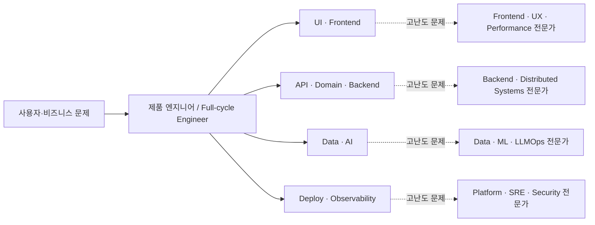

# AI 시대 소프트웨어 엔지니어의 커리어에 대한 인사이트

> 이 글은 [심층 리서치 보고서](./deep-research-report.md)를 읽고 얻은 개인적인 해석과 앞으로의 커리어 방향을 정리한 문서다.

## 한 문장 결론

앞으로는 프론트엔드나 백엔드라는 하나의 구현 영역에 자신을 가두기보다, **하나의 깊은 전문성을 기반으로 제품의 전체 생명주기를 책임질 수 있는 엔지니어**가 되어야 한다.

## 1. 직무가 아니라 제품 전체를 소유해야 한다

지금까지는 프론트엔드와 백엔드처럼 구현 영역을 기준으로 역할을 구분하는 방식이 일반적이었다. 그러나 AI가 레이어별 구현 비용을 낮추면서 이 경계의 의미는 점차 약해질 가능성이 크다.

그렇다고 모든 기술을 같은 깊이로 익혀야 한다는 뜻은 아니다. 필요한 것은 다음 두 축이다.

- AI가 만든 결과를 검증할 수 있는 **하나의 깊은 기술적 전문성**
- 사용자 문제부터 UI, API, 데이터, 배포, 관측성과 운영까지 연결하는 **제품 전주기 관점**

Vercel이 채용하고 있는 Forward-Deployed Engineer는 이런 변화를 보여주는 현재의 사례다. 고객 문제를 이해하고 프론트엔드 마이그레이션, 아키텍처, 성능, AI 애플리케이션까지 다루는 넓은 역할과 Backend, Compute, Security 같은 심층 전문 역할이 함께 존재한다.

따라서 내가 지향할 정체성은 단순한 Full-stack Developer가 아니다. **백엔드를 깊이의 축으로 삼되, 제품을 처음부터 운영까지 완결할 수 있는 Backend-anchored Product Engineer**에 가깝다.

## 2. 개발자는 사라지기보다 다른 형태로 늘어날 수 있다

처음에는 AI 때문에 개발자의 수가 줄고 내 자리도 사라질 수 있다고 생각했다. 보고서를 읽은 뒤에는 다른 가능성을 보게 됐다.

AI가 구현 비용을 낮추면 같은 인원으로 더 많은 소프트웨어를 만들 수 있다. 비용 하락이 수요 확대로 이어진다면 만들어지는 애플리케이션과 해결하려는 문제도 늘어난다. 이 경우 개발자라는 직업이 사라지는 것이 아니라 역할의 구성과 책임 범위가 달라질 수 있다.

다만 낙관만 할 수는 없다. 반복적인 화면 구현이나 CRUD API처럼 정형화된 작업만 수행하는 역할은 축소될 가능성이 높다. 반면 다음 역할은 여러 형태로 유지되거나 확대될 수 있다.

- 고객과 비즈니스 문제를 정의하는 역할
- 제품 전체를 설계하고 출시하는 역할
- AI가 만든 결과를 검증하고 통합하는 역할
- 데이터, 보안, 인프라, 신뢰성을 깊게 책임지는 역할
- 실제 운영 환경에서 장애와 품질을 책임지는 역할

즉, **개발자의 소멸보다 구현 중심 역할의 재편**에 가깝다. 나 역시 특정 레이어의 작업자가 아니라 제품과 시스템의 결과를 책임지는 방향으로 이동해야 한다.

## 3. 미래 조직은 넓은 제품 엔지니어와 깊은 전문가로 재편될 것이다

보고서의 「역할 수렴과 분화」 도식은 내가 예상하는 변화를 가장 이해하기 쉽게 보여준다.

핵심은 모든 개발자가 모든 분야의 전문가가 되는 것이 아니다. 일반적인 제품 개발자는 더 넓은 범위를 맡고, 어려운 문제는 각 분야의 깊은 전문가가 해결하는 구조다.

이 구조에서 가장 위험한 위치는 한 레이어의 정형화된 구현만 담당하는 사람이다. 반대로 유리한 위치는 다음 둘 중 하나다.

1. 제품의 전 과정을 연결하고 결과를 책임지는 엔지니어
2. AI의 결과까지 평가할 수 있는 깊은 분야 전문가

내 목표는 이 둘을 결합하는 것이다. 제품 전반을 다룰 수 있는 폭을 만들되, 백엔드와 시스템 영역의 깊이는 포기하지 않는다.

## 4. 로드맵은 일정표가 아니라 방향을 확인하는 기준이다

보고서가 제안한 학습 로드맵을 그대로 따르는 것은 현실적으로 어려울 수 있다. 업무, 프로젝트, 기술 변화 때문에 순서와 기간은 계속 달라질 것이다.

그럼에도 로드맵은 무엇을 지속적으로 확보해야 하는지 보여준다.

- 반대편 스택에서도 독립적으로 기능을 완성하는 능력
- CI/CD, 관측성, 롤백, 장애 대응을 포함한 운영 경험
- 테스트와 평가를 통해 AI 결과를 검증하는 능력
- 보안, 데이터, 성능, 비용을 함께 판단하는 능력
- 사용자 문제와 기술 구현을 연결하는 제품 감각
- 하나의 기술 영역에서 설계 판단을 내릴 수 있는 깊이

중요한 것은 계획을 완벽히 지키는 일이 아니다. 실제 업무와 프로젝트를 통해 위 역량을 반복해서 얻는 것이다. 특정 도구나 프레임워크를 많이 아는 것보다 **문제를 정의하고, 시스템을 설계하고, 결과를 검증하고, 운영에서 책임지는 능력**을 쌓아야 한다.

## 나의 커리어 원칙

앞으로의 선택을 다음 기준으로 판단한다.

- 직함보다 해결할 문제와 책임 범위를 본다.
- 백엔드를 깊은 전문성의 중심으로 유지한다.
- 프론트엔드, 데이터, 배포와 운영까지 제품을 완성할 수 있는 수준으로 넓힌다.
- AI 사용 자체를 역량으로 착각하지 않는다.
- AI가 만든 코드의 정확성, 보안, 성능과 장애 가능성을 직접 검증한다.
- 기술 목록보다 제품과 시스템에 만든 결과로 경력을 설명한다.
- 학습 계획의 완주보다 꾸준한 방향성을 우선한다.

## 최종 정리

내가 준비해야 할 미래는 프론트엔드와 백엔드를 모두 조금씩 하는 개발자가 되는 것이 아니다. **제품 전체를 이해하고 책임지면서, 한 영역에서는 깊은 판단을 내릴 수 있는 엔지니어**가 되는 것이다.

AI는 구현의 가치를 없애기보다 구현의 단가를 낮춘다. 그만큼 문제 선택, 설계, 검증, 통합과 운영의 중요성은 커진다. 앞으로의 커리어는 특정 포지션을 지키는 방향보다 변화한 환경에서도 제품을 끝까지 만들어 낼 수 있는 역량을 확보하는 방향으로 설계해야 한다.
