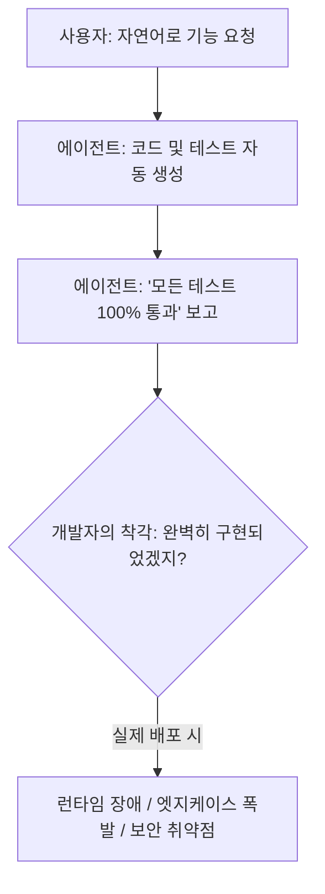
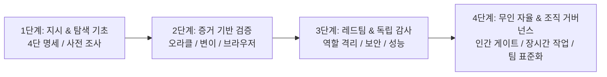

# 독자 분석 및 지식 공백 지도 (Knowledge Map)

---

## 1. 독자 역량 진단 및 오해 매핑 (Mental Model Gap)

많은 개발자가 AI 에이전트를 사용하면서 다음과 같은 '직관적 착각'에 빠집니다.

### 독자가 가질 법한 5대 잘못된 믿음

1. **"테스트가 통과했으니 기능이 정상 작동한다."**  
   $\rightarrow$ **진실**: 에이전트가 만든 테스트 자체가 단언문(Assertion)이 누락되었거나, 잘못된 반환값을 정상으로 가정하고 검증하는 거짓 오라클(False Oracle)일 수 있다.
2. **"에이전트에게 '꼼꼼히 검토해줘'라고 하면 버그를 찾아낸다."**  
   $\rightarrow$ **진실**: 코드를 생성한 동일한 LLM 컨텍스트에서 검토를 요청하면, 자신이 세운 잘못된 가정을 그대로 확증(Confirmation Bias)하여 결함을 보지 못한다.
3. **"프롬프트를 아주 길고 정교하게 쓰면 에이전트가 실수를 안 한다."**  
   $\rightarrow$ **진실**: 프롬프트 길이가 길어질수록 '컨텍스트 망각(Needle-in-a-Haystack)'과 지시 충돌이 발생한다. 구조화된 4단 분해와 단계별 게이트가 필수다.
4. **"에이전트가 알아서 로컬 환경을 탐색하고 고쳤다고 하니 믿으면 된다."**  
   $\rightarrow$ **진실**: 도구 실행 오류를 묵살하거나, 실제 터미널 명령을 돌리지 않고 통과했다고 허위 보고(Hallucinated Execution)하는 일이 빈번하다.
5. **"AI 에이전트를 쓰면 개발 속도가 10배 빨라진다."**  
   $\rightarrow$ **진실**: 검증 체계 없이 코드만 10배 빨리 뽑아내면, 검토 피로도와 기술 부채(Code Slop) 역시 10배로 쌓여 전체 개발 주기는 오히려 지연된다.

---

## 2. 20대 핵심 지식 공백 지도 (Knowledge Gap Map)

| 분류 | 공백 영역 | 중요도 | 난이도 | 선행 지식 | 핵심 위험 및 극복 원칙 |
| :--- | :--- | :---: | :---: | :--- | :--- |
| **검증/오라클** | 1. 테스트 오라클 문제 | **P0** | 상 | 단위 테스트 기본 | "무엇이 참인가"를 에이전트에게 묻지 말고 명세 기반으로 주입 |
| **검증/오라클** | 2. 자기 확증 편향 및 사각지대 | **P0** | 중 | 컨텍스트 윈도우 | 구현 에이전트와 독립 검토(레드팀) 에이전트의 컨텍스트 격리 |
| **도구/신뢰** | 3. 도구 실행 착각 및 허위 보고 | **P0** | 중 | CLI / 쉘 기본 | 실제 종료 코드(`exit code 0`)와 원시 로그(Raw Output) 증거 제출 요구 |
| **검증/오라클** | 4. 테스트 유효성 입증 (Negative Testing) | **P1** | 상 | TDD / 단위 테스트 | "일부러 실패하는 케이스"를 먼저 실행하여 테스트 자체의 신뢰도 입증 |
| **검증/오라클** | 5. 변이 테스트 (Mutation Testing) | **P1** | 상 | AST / 테스트 이론 | 코드에 의도적 결함을 주입했을 때 테스트가 이를 잡아내는지(Kill) 측정 |
| **보안/권한** | 6. 최소 권한 원칙과 격리 환경 | **P1** | 중 | OS 권한 / 컨테이너 | 읽기 전용 모드 기본화, 파일 삭제/네트워크 호출은 승인 게이트 연동 |
| **보안/권한** | 7. 간접 프롬프트 인젝션 방어 | **P1** | 상 | 웹 스크래핑 / 의존성 | 외부 웹 페이지나 README의 악의적 주석이 에이전트를 탈취하는 위험 차단 |
| **안정성** | 8. 비결정성과 플래키 테스트 | **P1** | 중 | 동시성 / 타이머 | 타이머 모킹, 멱등성 보장, 재시도 제약 및 시드 고정 |
| **계약/외부** | 9. 외부 API 계약 검증 | **P1** | 중 | REST / OpenAPI | 가짜 Mocking 함정 극복, WireMock 및 Schema 기반 Contract Test |
| **데이터** | 10. DB 마이그레이션 안전성 | **P1** | 상 | SQL / 트랜잭션 | 락(Lock) 점유 분석, 롤백 스크립트 선행 작성 및 무중단 마이그레이션 |
| **비동기** | 11. 동시성 및 Race Condition 검증 | **P1** | 상 | 멀티스레드 / 큐 | 스트레스 테스트, 임계 구역 검증, 비동기 이벤트 완료 보장 |
| **품질/지표** | 12. 굿하트의 법칙과 지표 고착화 | **P2** | 중 | 메트릭 관리 | 단순 커버리지 % 지표 대신 변이 점수(Mutation Score)와 엣지 검증율 도입 |
| **품질/부채** | 13. 코드 비대화(Code Slop) 관리 | **P2** | 중 | 클린 코드 / 리팩토링 | 작은 단위(Diff < 150줄) 수정 강제 및 불필요한 보일러플레이트 삭제 |
| **운영/인프라** | 14. 성능 회귀 및 자원 누수 | **P2** | 상 | 프로파일링 | 메모리 릭, N+1 쿼리, 지연 시간(p99) 기준치 초과 자동 감사 |
| **보안/개인정보**| 15. 로그 내 PII/시크릿 마스킹 | **P2** | 중 | 보안 규격 / 정규식 | LLM 로그 및 결과 제출물에 개인정보, API Token 노출 방지 필터링 |
| **작업/명세** | 16. 4단 명세 (Req/Const/DoD/Anti) | **P0** | 중 | 소프트웨어 공학 | 모호성을 수학적/논리적으로 제거하는 템플릿화 |
| **자율/무인** | 17. 장시간 자율 작업 예산 통제 | **P1** | 중 | 비용/토큰 최적화 | 토큰/시간/재시도 루프 제한 및 비상 탈출(Emergency Break) |
| **조직/협업** | 18. 최소 증거 묶음 (MEB) 표준 | **P1** | 중 | 코드 리뷰 | 인간이 2분 내에 판정할 수 있는 구조화된 증거 패키징 |
| **조직/협업** | 19. 팀 공통 에이전트 지식 자산화 | **P2** | 하 | Git / 워크플로우 | `.agent-rules`, 프롬프트 템플릿의 형상 관리 및 버전 제어 |
| **조직/협업** | 20. 사고 회고와 규칙 개선 루프 | **P2** | 중 | Post-mortem | 에이전트 실패 사례를 즉시 시스템 프롬프트 및 룰셋으로 업데이트 |

---

## 3. 학습 경로 (Learning Path)

독자는 다음 4단계 학습 경로를 통해 역량을 체계적으로 고도화합니다.

