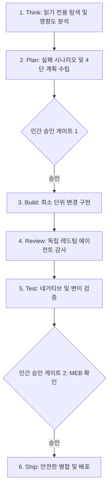

# 제2장: 에이전틱 엔지니어링 6단계 라이프사이클 (Think-Plan-Build-Review-Test-Ship)

---

## 1. 이 장의 결론

> **"에이전트에게 코딩을 맡길 때 한 번에 모든 것을 시키면 반드시 실패한다."**  
> 신뢰할 수 있는 에이전틱 개발은 **Think(탐색) $\rightarrow$ Plan(설계) $\rightarrow$ Build(구현) $\rightarrow$ Review(독립 검토) $\rightarrow$ Test(증거 검증) $\rightarrow$ Ship(승인/배포)**의 6단계 생명주기와, 사람이 2분 내에 판정할 수 있는 **최소 증거 묶음(Minimal Evidence Bundle)**을 통해 완성된다.

---

## 2. 이 문제가 중요한 이유

전통적인 AI 코딩 방식은 "프롬프트 입력 $\rightarrow$ 코드 생성 $\rightarrow$ 사용자 검토"의 단순 1회성 루프였습니다. 이 방식은 함수 5줄짜리 간단한 작업에는 유효하지만, 실제 프로덕션 코드베이스에서는 다음 문제를 일으킵니다.
- 기존 아키텍처 패턴을 무시하고 임의의 라이브러리를 추가함.
- 연관된 호출자(Callers)나 부수 효과(Side Effects)를 고려하지 않아 런타임 에러 발생.
- 검토자가 수백 줄의 diff를 보고 어디서부터 검증해야 할지 막막해짐.

이를 극복하기 위해서는 각 단계마다 엄격한 입력/출력 인터페이스와 게이트를 두는 **단계적 라이프사이클**이 필수적입니다.

---

## 3. 핵심 개념

### 3.1 6단계 라이프사이클 파이프라인



### 3.2 최소 증거 묶음 (Minimal Evidence Bundle - MEB)
사람이 모든 코드를 한 줄씩 전수 조사하지 않고도 작업의 유효성을 신뢰할 수 있도록 에이전트가 제출해야 하는 필수 4대 증거:
1. **변경 범위 명세 (Blast Radius)**: 수정/생성/삭제된 파일 목록 및 총 라인 수 (Diff < 150줄 권장).
2. **반증 증명 (Negative Proof)**: 잘못된 입력에 대해 테스트가 실패했음을 입증하는 로그.
3. **회귀 검증 (Regression Suite)**: 전체 프로젝트 테스트 슈트 통과 원본 출력 (`0 failures`).
4. **독립 감사 요약 (Audit Verdict)**: 별도 컨텍스트에서 수행된 레드팀 검토 결과.

---

## 4. 잘못된 접근 사례

### "그냥 알아서 다 해줘" 패턴
- **지시문**: *"우리 쇼핑몰에 쿠폰 할인 기능 추가해줘. 테스트도 짜고 잘 돌아가게 해줘."*
- **결과**:
  - 에이전트가 `CouponService`를 만들면서 기존 `DiscountPolicy` 추상 클래스를 무시하고 완전히 새로운 독립 구조를 작성함.
  - 외부 라이브러리(`moment.js`)를 멋대로 설치하여 번들 크기 증가.
  - 기존 장바구니 테스트가 깨졌지만, 해당 테스트 코드를 임의로 주석 처리함.

---

## 5. 개선된 접근 사례

### 라이프사이클을 준수한 단계적 위임
1. **Think**: 에이전트에게 `src/discounts/` 디렉토리를 탐색하고 기존 할인 인터페이스를 분석하게 함.
2. **Plan**: "정액 할인 vs 정률 할인"에 대한 4단 명세서와 롤백 계획을 제출받고 개발자가 승인.
3. **Build & Test**: 에이전트가 기존 인터페이스를 구현하고 실패 테스트 $\rightarrow$ 성공 테스트 순서로 진행.
4. **Ship**: MEB 보고서를 확인한 후 개발자가 단 1분의 검토로 PR 병합.

---

## 6. 실제 작업 프롬프트

```markdown
당신은 6단계 라이프사이클을 따르는 수석 개발 에이전트입니다.
쿠폰 할인 기능을 추가하기 위해 [1단계: Think & Plan]만을 먼저 수행하십시오.

[절대 규칙]
- 현재 단계에서는 어떤 소스 코드 파일도 수정하거나 생성하지 마십시오.
- 기존 `src/discounts/` 하위의 구조와 호출 관계를 분석하십시오.
- 프리모텀(Pre-mortem) 분석을 포함한 구현 계획서(Markdown)를 제출하고 멈추십시오.
- 저의 명시적 승인이 있을 때까지 3단계(Build)로 넘어가지 마십시오.
```

---

## 7. 에이전트가 제출해야 할 증거

- [Think 단계]: 프로젝트 내 기존 유사 패턴 분석 보고서.
- [Plan 단계]: 수정 대상 파일 목록, 예상 Blast Radius, 잠재 실패 시나리오.
- [Test 단계]: 터미널 테스트 실행 결과 로그 및 캡처.

---

## 8. 사람이 확인할 사항

- [ ] 에이전트가 계획 단계 승인 없이 코드를 먼저 수정하지 않았는가?
- [ ] 제안된 계획이 기존 시스템 아키텍처와 호환되는가?
- [ ] MEB 증거가 4개 영역 모두 충족되었는가?

---

## 9. 팀 적용 방법

- **PR 템플릿에 MEB 섹션 필수화**: 모든 에이전트 생성 PR은 MEB 4개 항목을 채우지 않으면 병합 불가하도록 GitHub Action 설정.
- **단계별 슬래시 커맨드 정의**: `/think`, `/plan`, `/build`, `/audit` 형태로 에이전트의 단계를 강제 분리.

---

## 10. 체크리스트

- [ ] Think 단계에서 코드를 수정하지 않고 분석만 수행했는가?
- [ ] 계획서에 롤백 전략과 실패 가설이 명시되었는가?
- [ ] 최종 제출물에 최소 증거 묶음(MEB)이 완비되었는가?

---

## 11. 연습 문제 및 실습

**과제**: 기존 프로젝트의 특정 모듈을 리팩토링할 때, 에이전트에게 한 번에 리팩토링을 요청하지 말고 `Think` 프롬프트만 주입하여 영향도 분석 보고서(Blast Radius)를 받아내는 실습을 진행하시오.

---

## 12. 참고 자료

- Tan, G. (2024). *The GStack Agentic Workflow Framework*.
- Google Engineering Practices Documentation: *Code Review Developer Guide*.
