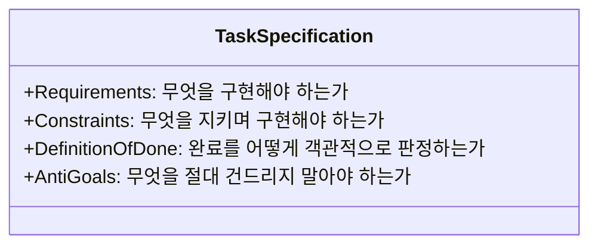

# 제3장: 실패 없는 작업 지시서 작성법: 4단 명세 프레임워크

---

## 1. 이 장의 결론

> **"모호한 프롬프트는 에이전트의 '자의적 환각'을 낳는다."**  
> 모든 성공적인 에이전트 위임은 **요구사항(Requirements), 제약조건(Constraints), 완료조건(DoD), 금지사항(Anti-Goals)**의 4단 구조로 작업을 분해할 때 비로소 재현성과 신뢰성을 얻는다.

---

## 2. 이 문제가 중요한 이유

자연어는 본질적으로 모호합니다. 인간 개발자 사이에서는 "적당히 알아서" 통용되는 암묵적 맥락(Implicit Context)이 존재하지만, LLM 에이전트는 확률적으로 가장 그럴듯한 경로를 자의적으로 선택합니다.
예컨대 "권한 기능을 추가해줘"라고 지시하면, 에이전트는 기존 세션 기반 인증을 JWT로 통째로 갈아엎거나, 관리자 권한 체크를 프론트엔드 단에서만 처리하는 등 파괴적인 결정을 스스로 내려버립니다.

---

## 3. 핵심 개념: 4단 명세 프레임워크 (RC-DA)



1. **요구사항 (Requirements)**: 기능적 동작, 입력-출력 관계, 엣지 케이스 처리.
2. **제약조건 (Constraints)**: 아키텍처 규칙, 파일 수정 제한 범위, 성능 기준, 라이브러리 사용 제한.
3. **완료조건 (Definition of Done)**: 성공/실패 테스트 증거, 타입 체킹, 린트 에러 0건.
4. **금지사항 (Anti-Goals)**: 범위 밖의 리팩토링, 불필요한 의존성 설치, 설정 파일 임의 변경 금지.

---

## 4. 잘못된 접근 사례

### [사례 3: 인증 및 권한(RBAC) 기능 구현] - 모호한 요청
- **지시문**: *"우리 서비스에 관리자(ADMIN)랑 일반 사용자(USER) 권한 체크하는 미들웨어 만들어줘."*
- **문제 발생**:
  - 에이전트가 권한이 없는 경우 HTTP 403이 아닌 500 Server Error를 반환하도록 작성.
  - 기존 세션 객체 구조를 임의로 변경하여 기존 로그인 기능 전체를 깨뜨림.
  - 비인가 요청에 대해 로그를 남기지 않아 보안 감사 불가능.

---

## 5. 개선된 접근 사례

### 4단 명세가 적용된 작업 요청서

```markdown
# [작업 명세] 역할 기반 접근 제어(RBAC) 미들웨어 구현

## 1. 요구사항 (Requirements)
- [ ] `requireRole(['ADMIN'])` 미들웨어 구현: `req.user.role`이 일치하지 않으면 `HTTP 403 Forbidden` 반환.
- [ ] 비인가 접근 시도 시 보안 감사 로그(`logger.warn('UNAUTHORIZED_ACCESS_ATTEMPT', { userId, path })`) 기록.
- [ ] 인증되지 않은 사용자(`req.user` 없음)는 `HTTP 401 Unauthorized` 반환.

## 2. 제약조건 (Constraints)
- 기존 Express 미들웨어 체인 및 `src/middlewares/` 폴더 컨벤션 준수.
- 외부 라이브러리 추가 금지 (기존 내부 로거 및 에러 팩토리 활용).
- 파일 수정 범위: `src/middlewares/rbac.ts`, `tests/middlewares/rbac.test.ts` 2개로 한정.

## 3. 완료조건 (Definition of Done)
- [ ] ADMIN 권한 정상 통과(200), USER 권한 거부(403), 미인증 거부(401) 3종 단위 테스트 통과.
- [ ] `npm run lint` 및 `npx tsc --noEmit` 무결점 증명.

## 4. 금지사항 (Anti-Goals)
- ❌ 기존 `auth.ts` 토큰 발급 로직 수정 금지.
- ❌ DB 스키마나 User 테이블 변경 금지.
```

---

## 6. 실제 작업 프롬프트

위의 4단 명세서 템플릿(템플릿 1)을 그대로 복사하여 에이전트에게 전달하고, 구현 전 질문 목록이 있는지 먼저 회신하도록 유도합니다.

---

## 7. 에이전트가 제출해야 할 증거

1. **역할별 3대 테스트 실행 로그**: 401(미인증), 403(권한부족), 200(권한일치) 시나리오 통과 증적.
2. **보안 감사 로그 출력 캡처**: 모킹된 로거에 정확한 파라미터가 인입되었는지 확인한 로그.

---

## 8. 사람이 확인할 사항

- [ ] 에이전트가 `req.user`의 null-safety(옵셔널 체이닝 등)를 완벽히 처리했는가?
- [ ] 401과 403 상태 코드가 명세대로 정확히 분리되었는가?
- [ ] 지정된 2개 파일 외에 다른 파일이 변경되지 않았는가 (`git status`)?

---

## 9. 팀 적용 방법

- **이슈 트래커(Jira/GitHub Issue) 템플릿 표준화**: 개발자가 에이전트에게 일을 시킬 때 복사할 수 있는 4단 명세 마크다운 템플릿을 저장소 `.github/ISSUE_TEMPLATE/`에 등록.

---

## 10. 체크리스트

- [ ] 요구사항에 정상 플로우뿐 아니라 예외 상태 코드가 명시되었는가?
- [ ] 수정 가능한 디렉토리와 파일의 경계가 명확한가?
- [ ] 건드리지 말아야 할 금지사항(Anti-Goals)이 최소 2개 이상 포함되었는가?

---

## 11. 연습 문제 및 실습

**과제**: "게시글 삭제 API"를 구현하라는 지시문을 4단 명세(작성자 본인만 삭제 가능, 관리자는 모두 삭제 가능, 삭제 시 Soft Delete 플래그 처리)로 작성하여 에이전트에게 전달해 보시오.

---

## 12. 참고 자료

- Cockburn, A. (2000). *Writing Effective Use Cases*. Addison-Wesley.
- OWASP Top 10: *Broken Access Control Prevention Cheat Sheet*.
