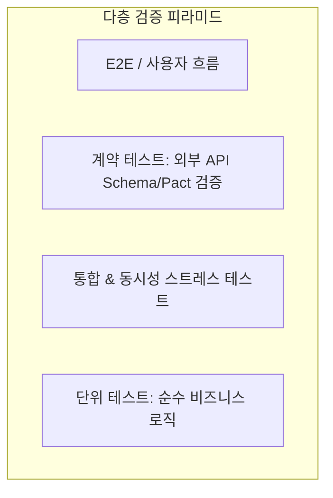

# 제6장: 도메인별 다층 테스트와 계약 검증

---

## 1. 이 장의 결론

> **"모든 것을 모킹(Mocking)하면 아무것도 검증되지 않는다."**  
> 외부 API 연동과 비동기 동시성 처리는 단순 단위 테스트의 Mock만으로는 결코 런타임 신뢰성을 보장할 수 없다. **계약 테스트(Contract Testing)**와 **스트레스 동시성 테스트**를 통해 실제 환경과의 간극을 메워야 한다.

---

## 2. 이 문제가 중요한 이유

에이전트가 가장 쉽게 저지르는 실수 중 하나는 '테스트를 쉽게 통과시키기 위해 외부 환경 전체를 가짜 객체(Mock)로 감싸버리는 것'입니다.
- **외부 API의 함정**: 외부 결제 API의 응답 스키마가 변경되었거나 에러 포맷이 바뀌었음에도, 에이전트가 만든 Mock은 여전히 성공 상태를 흉내 냅니다.
- **동시성의 함정**: 단일 스레드 단위 테스트에서는 완벽히 통과하지만, 실제 다중 요청이 몰릴 때 레이스 컨디션(Race Condition)으로 인한 중복 출금이나 데이터 꼬임이 발생합니다.

---

## 3. 핵심 개념



### 3.1 계약 테스트 (Contract Testing & WireMock)
실제 외부 서비스의 OpenAPI/JSON 스키마 규격을 기준으로 Mocking을 생성하여, 서비스 간의 '인터페이스 계약(Contract)'이 깨졌을 때 즉시 감지하는 기법.

### 3.2 동시성 및 레이스 컨디션 검증
비동기 큐, 락(Distributed Lock), DB 트랜잭션 격리 수준을 검증하기 위해 수십 개의 비동기 Promise를 병렬(`Promise.all`) 실행하여 원자성(Atomicity)을 증명하는 기법.

---

## 4. 잘못된 접근 사례

### [사례 2: 외부 PG사 결제 API 연동] - 무의미한 Mocking
- **에이전트가 작성한 코드**:
  ```typescript
  // ❌ 무의미한 Mock 테스트: 외부 API가 실제로 뭘 주든 상관없이 무조건 통과
  jest.spyOn(paymentClient, 'charge').mockResolvedValue({ status: 'OK' });
  const res = await orderService.pay(orderId);
  expect(res.isPaid).toBe(true);
  ```
- **문제점**: 실제 PG사는 `{ code: 200, result: { transactionId: '...' } }` 구조로 응답을 주는데, 에이전트가 자의적으로 `{ status: 'OK' }`라고 가짜 Mock을 만들어 배포 즉시 런타임 Crash 발생.

---

## 5. 개선된 접근 사례

### 스키마 계약 검증 및 동시성 멱등성 테스트

#### [사례 2 개선: Zod 스키마 기반 계약 검증]
```typescript
// ✅ 외부 API 응답 스키마 계약 정의
export const PaymentResponseSchema = z.object({
  code: z.number(),
  result: z.object({
    transactionId: z.string(),
    paidAmount: z.number().positive(),
  }),
});

// 테스트: 스키마 불일치 시 런타임 에러 감지 검증
it('외부 API 응답이 계약 스키마와 불일치할 경우 SchemaValidationError를 던져야 한다', async () => {
  wiremock.stubForPost('/charge', { status: 'INVALID_PAYLOAD' }); // 계약 위반 응답
  await expect(paymentClient.charge(payload)).rejects.toThrow(SchemaValidationError);
});
```

#### [사례 7 개선: 동시성 10개 요청에 대한 재고 차감 멱등성 검증]
```typescript
it('재고가 1개인 상품에 대해 10명이 동시에 주문할 경우 정확히 1명만 성공해야 한다', async () => {
  const stockService = new StockService(db);
  await stockService.initStock('ITEM_1', 1);

  // 10개 동시 요청 병렬 발송
  const results = await Promise.allSettled(
    Array.from({ length: 10 }).map((_, i) => stockService.decreaseStock('ITEM_1', `USER_${i}`))
  );

  const succeeded = results.filter(r => r.status === 'fulfilled');
  const failed = results.filter(r => r.status === 'rejected');

  expect(succeeded.length).toBe(1);
  expect(failed.length).toBe(9);
  expect(await stockService.getStock('ITEM_1')).toBe(0);
});
```

---

## 6. 실제 작업 프롬프트

```markdown
당신은 백엔드 신뢰성 엔지니어입니다.
외부 API 연동 및 재고 차감 모듈을 구현하십시오.

[검증 지침]
1. 외부 API 연동부는 Zod를 활용하여 응답 스키마 계약 검증을 구현하십시오.
2. 단위 테스트 작성 시 임의의 가짜 Mock 객체 생성을 금지하며, 스키마 유효성 실패 케이스를 포함하십시오.
3. 재고 차감 로직은 `Promise.all` 기반의 동시성 10회 요청 스트레스 테스트를 작성하여 Race Condition이 없음을 입증하십시오.
```

---

## 7. 에이전트가 제출해야 할 증거

- [증거 1]: 스키마 불일치 예외 테스트 실행 로그.
- [증거 2]: 동시성 다중 요청 실행 결과 (`1 fulfilled, 9 rejected`) 터미널 원본 로그.

---

## 8. 사람이 확인할 사항

- [ ] 비동기 락 또는 DB 비관적/낙관적 락 메커니즘이 적절히 사용되었는가?
- [ ] 외부 API 타임아웃 및 서킷 브레이커 설정이 누락되지 않았는가?

---

## 9. 팀 적용 방법

- **Pact / OpenAPI Spec CI 검증 파이프라인**: 마이크로서비스 간의 API 인터페이스 변경 시 계약 테스트를 자동 실행하여 의존성 충돌 선제 차단.

---

## 10. 체크리스트

- [ ] 외부 API 호출부에 런타임 스키마 유효성 검증(Zod/Joi)이 적용되었는가?
- [ ] 공유 자원에 대한 동시성 테스트가 작성되었는가?
- [ ] 네트워크 지연 및 타임아웃 시나리오가 처리되었는가?

---

## 11. 연습 문제 및 실습

**과제**: 포인트 충전/차감 시스템에 대해 동시 다발적인 차감 요청이 발생할 때 잔액이 음수로 떨어지지 않는지 검증하는 동시성 테스트 코드를 에이전트에게 작성시키시오.

---

## 12. 참고 자료

- Newman, S. (2021). *Building Microservices (2nd ed.)*. O'Reilly. (계약 테스팅)
- Kleppmann, M. (2017). *Designing Data-Intensive Applications*. O'Reilly. (동시성 및 트랜잭션 격리)
