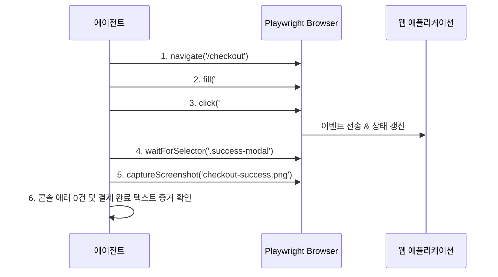

# 제7장: 브라우저 기반 E2E 및 사용자 흐름 자율 검증

---

## 1. 이 장의 결론

> **"사용자가 경험하는 것은 단위 테스트 함수가 아니라 '브라우저 화면'이다."**  
> 백엔드 API와 프론트엔드 상태가 결합된 실제 사용자 흐름은 헤드리스 브라우저(Playwright/Puppeteer)를 통한 **실제 DOM 클릭, 비동기 렌더링 대기, 시각적 회귀(Visual Regression) 스크린샷 증거**로 검증해야 한다.

---

## 2. 이 문제가 중요한 이유

프론트엔드 작업에서 에이전트의 흔한 실패 유형:
- React 컴포넌트 단위 테스트(`render(<Button />)`)는 100% 통과했지만, 실제 페이지에서 CSS `z-index`에 가려져 버튼을 클릭할 수 없음.
- 폼 입력 후 제출 시 비동기 응답 처리 중 상태 업데이트 누락으로 무한 로딩 스피너 발생.
- 모바일 뷰포트에서 레이아웃이 깨져 결제 버튼이 화면 밖으로 밀려남.

이러한 UI/UX 결함은 오직 **브라우저를 직접 조작하는 E2E 검증 에이전트**를 통해서만 잡아낼 수 있습니다.

---

## 3. 핵심 개념

### 3.1 자율 브라우저 조작 및 판정 루프


---

## 4. 잘못된 접근 사례

### [사례 6: 장바구니 결제 흐름] - 가짜 UI 검증
- **문제점**:
  - 에이전트가 Jest/React Testing Library로 가짜 이벤트를 발생시키고 스냅샷 테스트만 생성함.
  - 실제 백엔드 API와 통신하는 런타임 CORS 에러나 브라우저 쿠키 미전송 문제를 전혀 감지하지 못함.

---

## 5. 개선된 접근 사례

### Playwright 기반 자율 E2E 시나리오 및 시각적 증거 수집

```typescript
import { test, expect } from '@playwright/test';

test('장바구니 상품 추가 후 결제 완료 전체 흐름 검증', async ({ page }) => {
  // 1. 브라우저 콘솔 에러 감지 리스너 등록
  const consoleErrors: string[] = [];
  page.on('console', msg => {
    if (msg.type() === 'error') consoleErrors.push(msg.text());
  });

  // 2. 상품 상세 페이지 접속 및 담기
  await page.goto('/products/item-123');
  await page.click('button[data-testid="add-to-cart"]');
  await expect(page.locator('.cart-badge')).toHaveText('1');

  // 3. 결제 페이지 이동 및 주문 제출
  await page.goto('/checkout');
  await page.fill('#shipping-address', '서울특별시 강남구 테헤란로 123');
  await page.click('#submit-order-button');

  // 4. 주문 완료 화면 및 주문번호 DOM 검증
  const orderSuccess = page.locator('[data-testid="order-complete-message"]');
  await expect(orderSuccess).toBeVisible({ timeout: 5000 });
  await expect(orderSuccess).toContainText('주문이 정상적으로 완료되었습니다');

  // 5. 시각적 증거 스크린샷 캡처
  await page.screenshot({ path: 'artifacts/evidence/checkout-complete.png', fullPage: true });

  // 6. 콘솔 에러 무결점 단언
  expect(consoleErrors).toEqual([]);
});
```

---

## 6. 실제 작업 프롬프트

템플릿 9를 기반으로 에이전트에게 지시합니다:

```markdown
당신은 E2E 자동화 테스트 엔지니어입니다.
장바구니-주문 결제 플로우를 Playwright로 검증하십시오.

[필수 제출물]
1. E2E 테스트 실행 결과 로그 (`npx playwright test`).
2. 최종 결제 완료 화면 스크린샷 이미지 파일 (`artifacts/evidence/*.png`).
3. 테스트 실행 중 발생한 브라우저 콘솔 에러가 0건임을 입증하는 단언문.
```

---

## 7. 에이전트가 제출해야 할 증거

- [스크린샷 증거]: 결제 완료 화면 스크린샷.
- [네트워크/콘솔 로그]: HTTP 500 또는 Unhandled Promise Rejection 0건 증명.

---

## 8. 사람이 확인할 사항

- [ ] 제출된 스크린샷에서 UI 컴포넌트의 겹침이나 스타일 깨짐이 없는가?
- [ ] 비동기 대기(`waitForSelector`)가 하드코딩된 `sleep(3000)` 대신 상태 기반으로 작성되었는가?

---

## 9. 팀 적용 방법

- **PR마다 Visual Regression 스크린샷 자동 업로드**: GitHub Action에서 Playwright 실행 후 스크린샷 diff를 PR 코멘트에 자동으로 렌더링.

---

## 10. 체크리스트

- [ ] 실제 브라우저 환경에서 엔드-투-엔드 플로우가 실행되었는가?
- [ ] 브라우저 콘솔 에러 리스너가 포함되었는가?
- [ ] 결과 스크린샷이 증거 아티팩트로 저장되었는가?

---

## 11. 연습 문제 및 실습

**과제**: "회원가입 폼"에 대해 잘못된 이메일 입력 시 인라인 에러 문구가 표시되는지 확인하고, 올바른 입력 시 환영 페이지로 리다이렉트되는 E2E 테스트를 작성하여 스크린샷을 생성하시오.

---

## 12. 참고 자료

- Playwright Documentation: *Best Practices for End-to-End Web Testing*.
