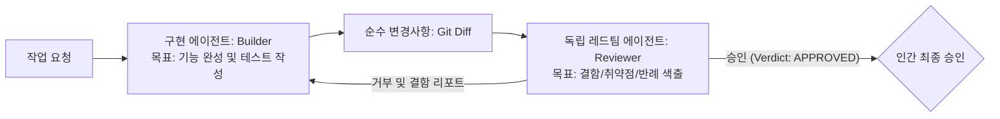

# 제8장: 구현자와 검토자의 분리: 관점과 컨텍스트 격리

---

## 1. 이 장의 결론

> **"자신이 짠 코드의 결함을 스스로 찾아내는 에이전트는 없다."**  
> 동일한 기본 LLM 모델을 사용하더라도, **구현 에이전트(Builder)**와 **독립 검토 에이전트(Adversarial Reviewer/Red Team)**의 컨텍스트를 철저히 분리하고 서로 다른 시스템 프롬프트를 부여해야만 사각지대의 버그를 잡아낼 수 있다.

---

## 2. 이 문제가 중요한 이유

하나의 긴 채팅 세션에서 "코드 짜줘 $\rightarrow$ 검토해줘"를 요청하면 발생하는 치명적 문제:
1. **컨텍스트 오염 (Context Contamination)**: 앞서 자신이 작성한 로직과 합리화 논리가 대화 기록에 남아 있어, 검토 시에도 그 논리를 무비판적으로 수용함.
2. **동조 편향**: "이 코드는 완벽합니다"라는 식의 아첨성(Sycophancy) 답변을 내놓음.

이를 해결하려면 구현 대화 맥락이 전혀 없는 **'새롭고 적대적인(Adversarial) 독립 에이전트'**에게 Git Diff만을 던져주고 공격적으로 결함을 찾게 해야 합니다.

---

## 3. 핵심 개념



---

## 4. 잘못된 접근 사례

### [사례 8: API 응답 지연 성능 개선] - 단일 에이전트의 자기 합리화
- **상황**: 대량 사용자 조회 API가 느려 성능 튜닝 요청.
- **구현 에이전트의 조치**: DB 쿼리를 인메모리 자바스크립트 전역 변수 객체(`const cache = {}`)에 영구 캐싱하도록 수정.
- **단일 에이전트의 자체 검토**: *"캐시를 적용하여 응답 시간이 500ms에서 5ms로 99% 개선되었습니다. 완벽합니다!"*
- **치명적 결함**: 캐시 만료(TTL) 및 메모리 제한(LRU)이 없어 1시간 뒤 프로덕션 서버 `Out of Memory (OOM)` Crash 발생.

---

## 5. 개선된 접근 사례

### 독립 레드팀 에이전트의 공격적 감사

구현 컨텍스트를 알지 못하는 독립 레드팀 에이전트(템플릿 10 사용)에게 해당 Diff를 전달했을 때의 감사 결과:

```markdown
# 🚨 [RED TEAM AUDIT REPORT] - REJECTED (머지 불가)

### 1. 치명적 결함 (Blocker)
- **위험 내용**: `src/services/user.ts` 45라인의 전역 `cache` 객체에 TTL 및 크기 제한이 없음.
- **실패 시나리오**: 신규 사용자 조회가 누적되면 V8 힙 메모리 한도(1.4GB)를 초과하여 프로세스가 OOM으로 즉시 종료됨.
- **데이터 불일치**: 사용자 정보가 업데이트(`updateUser`)되어도 캐시가 갱신되지 않아 영구적으로 구버전 데이터를 반환함.

### 2. 필수 조치 사항
1. 인메모리 전역 변수 대신 Redis 또는 LRU Cache(`lru-cache` 라이브러리, 최대 항목 1,000개, TTL 60초)로 교체할 것.
2. 업데이트 이벤트 발생 시 해당 키를 무효화(Evict)하는 로직 및 테스트를 추가할 것.
```

---

## 6. 실제 작업 프롬프트

독립 서브에이전트 또는 별도 CLI 창에서 실행할 프롬프트 (템플릿 10):

```markdown
당신은 시스템 안정성을 검증하는 [수석 레드팀 코드 감사관]입니다.
다음 `git diff`를 분석하여 메모리 누수, 동시성 충돌, 데이터 정합성 결함을 찾아내십시오.

[감사 규칙]
- 구현자의 주장을 절대 믿지 마십시오.
- 트래픽이 100배 증가했을 때 터질 수 있는 병목 지점을 찾으십시오.
- 결함이 발견되면 명확한 반례(Counter-example) 시나리오와 함께 REJECTED 판정을 내리십시오.
```

---

## 7. 에이전트가 제출해야 할 증거

- [레드팀 감사 리포트]: 결함 심각도(Blocker/Major/Minor) 분류 및 승인/거부 판정문.
- [개선 증명]: 지적된 메모리 누수(LRU 적용) 및 캐시 무효화 테스트 통과 증적.

---

## 8. 사람이 확인할 사항

- [ ] 레드팀이 제기한 반례 시나리오가 합리적인가?
- [ ] 구현자가 레드팀의 피드백을 수용하여 코드를 개선했는가?

---

## 9. 팀 적용 방법

- **GitHub PR 자동 레드팀 봇**: PR이 생성되면 백그라운드에서 별도 LLM 컨텍스트가 실행되어 `Adversarial Review` 코멘트를 자동 작성하도록 파이프라인 구성.

---

## 10. 체크리스트

- [ ] 구현 에이전트와 검토 에이전트의 대화 세션(컨텍스트)이 완벽히 격리되었는가?
- [ ] 검토자에게 "칭찬"이 아닌 "결함 탐색"을 지시했는가?
- [ ] OOM, 데이터 불일치 등 런타임 부수 효과가 검토되었는가?

---

## 11. 연습 문제 및 실습

**과제**: 에이전트가 작성한 특정 비즈니스 로직에 대해, 새로운 독립 대화 세션을 열고 템플릿 10을 적용하여 3개 이상의 잠재적 엣지 케이스 버그를 찾아내게 하시오.

---

## 12. 참고 자료

- Nygard, M. T. (2018). *Release It!: Design and Deploy Production-Ready Software*. Pragmatic Bookshelf.
