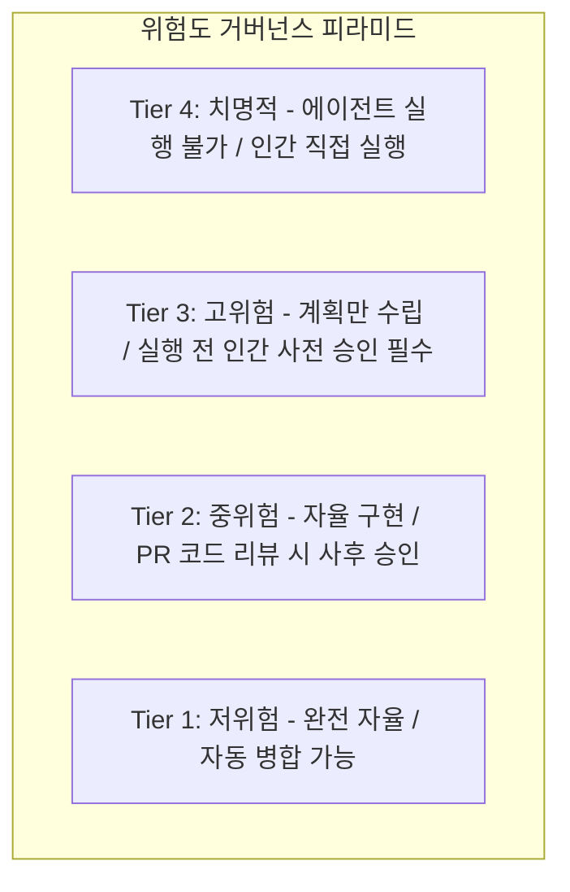

# 제10장: 위험도 분류표와 인간 승인 게이트 (Human-in-the-Loop)

---

## 1. 이 장의 결론

> **"모든 것을 사람이 검토하면 에이전트 도입의 이점이 사라지고, 아무것도 검토하지 않으면 회사가 망한다."**  
> 위험도 4단계 분류 체계(Tier 1~Tier 4)를 통해 **저위험 작업은 100% 자율화**하고, **치명적 고위험 작업은 강력한 인간 승인 게이트(Human-in-the-Loop)**로 묶어 생산성과 안전의 균형을 완성해야 한다.

---

## 2. 이 문제가 중요한 이유

에이전트를 도입한 조직이 겪는 양극단의 비효율:
- **과도한 통제 (Micro-management)**: 함수 이름 바꾸기, 오타 수정 등 사소한 작업까지 사람이 일일이 엔터 키를 눌러 승인하느라 개발 피로도 극대화.
- **통제 부재 (Blind Trust)**: 에이전트에게 "운영 DB 최적화해줘"라고 했다가 `DROP TABLE`이나 대규모 데이터 삭제 명령이 무인 실행되어 서비스 중단.

효율적인 엔지니어링 리더십은 **"어디까지를 에이전트에게 온전히 맡기고, 어디서 멈추어 사람의 결재를 받게 할 것인가"**에 대한 명확한 규칙을 세우는 데서 출발합니다.

---

## 3. 핵심 개념: 4단계 위험도 분류 체계



| 등급 | 위험 수준 | 대상 작업 예시 | 에이전트 권한 | 인간 개입 시점 |
| :---: | :--- | :--- | :--- | :--- |
| **Tier 1** | **저위험 (Low)** | 문서 작성, 단위 테스트 보강, 오타 수정, 정적 분석 린트 정리 | 완전 자율 (Full Auto) | 사후 통계 확인 |
| **Tier 2** | **중위험 (Medium)** | 신규 API 개발, 비즈니스 로직 수정, UI 컴포넌트 개발 | 자율 구현 + MEB 증거 제출 | PR 코드 리뷰 시 |
| **Tier 3** | **고위험 (High)** | DB 마이그레이션, 인증/인가 수정, 외부 결제 연동, 패키지 업그레이드 | 계획서 및 롤백 스크립트 작성까지만 허용 | **코드 수정/실행 전 사전 승인** |
| **Tier 4** | **치명적 (Critical)** | 프로덕션 배포, 데이터 삭제(Drop/Truncate), 시크릿 키 발급/폐기 | **실행 권한 원천 차단** | **인간 직접 수행** |

---

## 4. 잘못된 접근 사례

### 위험도 구분 없는 일괄 승인 허용
- **사례**: 개발자가 에이전트에게 `--dangerously-skip-permissions` (모든 권한 자동 승인) 옵션을 켜고 "결제 모듈 리팩토링"을 지시함.
- **참사**: 에이전트가 테스트 DB가 아닌 로컬 개발 DB의 결제 트랜잭션 테이블을 `TRUNCATE`하여 3개월치 개발 데이터가 영구 유실됨.

---

## 5. 개선된 접근 사례

### 정책 기반 승인 인터셉터 (Policy-based Gate)

```typescript
// ✅ 위험 명령 실행 인터셉터 의사코드
async function executeAgentCommand(command: string, tier: RiskTier) {
  if (tier === RiskTier.TIER_4_CRITICAL) {
    throw new SecurityException('Tier 4 치명적 명령은 에이전트가 실행할 수 없습니다. 수동으로 실행하십시오.');
  }

  if (tier === RiskTier.TIER_3_HIGH) {
    const approved = await requestHumanApprovalModal({
      title: '고위험 작업 실행 승인 요청',
      command: command,
      riskAnalysis: 'DB 스키마 변경 및 데이터 구조 변환 포함',
      rollbackPlanAvailable: true,
    });
    if (!approved) throw new UserRejectedException('사용자에 의해 작업이 거부되었습니다.');
  }

  // Tier 1, 2는 자동 실행
  return runCommand(command);
}
```

---

## 6. 실제 작업 프롬프트

템플릿 15를 활용하여 에이전트 시스템 룰에 선언:

```markdown
당신은 조직의 안전 정책을 준수하는 엔지니어링 에이전트입니다.
작업 중 [Tier 3: 고위험] 또는 [Tier 4: 치명적] 작업에 해당하는 변경(DB 변경, 인증 로직, 배포 등)이 필요할 경우,
절대 임의로 실행하지 말고 [계획서 및 롤백 절차]를 출력한 후 저의 명시적 승인을 기다리십시오.
```

---

## 7. 에이전트가 제출해야 할 증거

- [사전 승인 요청서]: 작업 위험 등급, Blast Radius, 롤백 절차 명시.
- [인간 승인 로그]: 승인자 ID 및 승인 일시 기록.

---

## 8. 사람이 확인할 사항

- [ ] Tier 3 이상 작업에 대한 롤백 방안이 구체적으로 마련되어 있는가?
- [ ] 에이전트가 승인 게이트를 우회할 수 있는 우회 스크립트를 작성하지 않았는가?

---

## 9. 팀 적용 방법

- **GitHub Branch Protection 및 다중 서명**: `main` 브랜치 푸시는 에이전트 봇 단독으로 불가능하며, 최소 1인 이상의 시니어 개발자 서명이 있어야만 Merge 가능하도록 강제.

---

## 10. 체크리스트

- [ ] 프로젝트 작업들이 4단계 위험도로 명확히 분류되어 있는가?
- [ ] 파괴적 명령어(`DROP`, `rm -rf`, `deploy`)가 에이전트 툴체인에서 차단되었는가?
- [ ] 인간 승인 이력이 감사 로그로 기록되는가?

---

## 11. 연습 문제 및 실습

**과제**: 팀의 기존 개발 업무 10가지를 나열하고, 템플릿 15를 활용하여 Tier 1부터 Tier 4까지의 위험도 매트릭스를 직접 작성해 보시오.

---

## 12. 참고 자료

- European Union: *EU Artificial Intelligence Act (2024)* (고위험 AI 거버넌스 및 인간 감독 요건).
