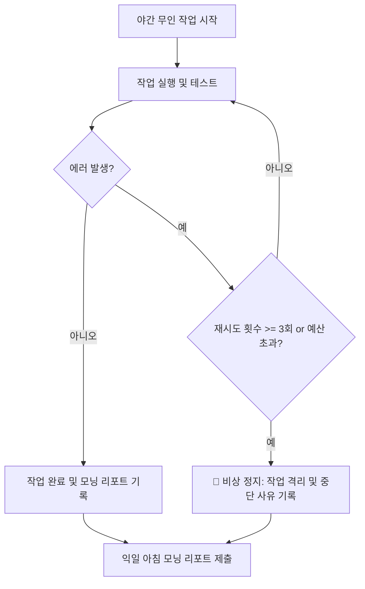

# 제11장: 장시간 자율 작업(Overnight Mode)과 비상 정지 메커니즘

---

## 1. 이 장의 결론

> **"사용자가 잠든 밤에도 에이전트는 일할 수 있지만, '예산과 탈출구'가 없는 자율 작업은 재앙을 부른다."**  
> 안전한 장시간 자율 작업(Overnight Mode)은 **비용/시간/루프 예산(Budgeting)**, **비상 정지(Kill-switch) 조건**, 그리고 **익일 아침 모닝 리포트(Morning Report)**가 갖추어졌을 때 비로소 가치를 발휘한다.

---

## 2. 이 문제가 중요한 이유

개발자가 퇴근하면서 에이전트에게 "밤새 레거시 모듈 리팩토링하고 테스트 채워놔"라고 맡겨두었을 때 흔히 일어나는 참사:
1. **무한 루프와 비용 폭증**: 빌드 에러 하나를 못 고쳐 밤새 500번 재시도하면서 API 토큰 비용 500달러 소진.
2. **코드 파괴적 변형**: 한 파일의 타입 에러를 잡으려다 주변 수십 개 파일을 멋대로 뜯어고쳐 전체 프로젝트가 컴파일 불능 상태로 전락.
3. **증적 없는 종료**: 다음 날 아침 출근했을 때 에이전트가 무엇을 고쳤고 무엇을 실패했는지 알 수 없어 결국 `git reset --hard`로 날려버림.

---

## 3. 핵심 개념

### 3.1 3대 하드 예산 (Hard Budgets)
1. **토큰/비용 예산**: 1회 세션당 최대 허용 비용 한도 설정 (예: 최대 \$10).
2. **재시도 루프 예산**: 동일한 에러에 대한 연속 재시도 3회 초과 시 작업 즉시 격리(Quarantine) 및 스킵.
3. **수정 반경 예산**: 최대 수정 파일 개수($\le 5$개) 및 총 라인 변경 수($\le 300$줄) 제한.



---

## 4. 잘못된 접근 사례

### [사례 10: 야간 무인 레거시 정리] - 통제 없는 무인 작업의 파멸
- 에이전트에게 아무런 제약 없이 "미사용 코드 전부 지우고 테스트 통과시켜놔"라고 지시.
- 에이전트가 테스트가 없는 핵심 비즈니스 로직을 '미사용 코드'로 오판하여 삭제함.
- 프로젝트 빌드가 깨지자, 빌드를 통과시키기 위해 관련 타입 정의와 검증 로직까지 연쇄 삭제함.

---

## 5. 개선된 접근 사례

### [사례 9 & 10: 안전한 무인 로그 분석 및 테스트 보강]

1. **격리된 작업 브랜치 생성**: `agent/overnight-refactor-20260824`
2. **작업 단위별 격리 실행**:
   - `Task 1: OrderService 단위 테스트 작성` $\rightarrow$ 성공 $\rightarrow$ 로컬 커밋.
   - `Task 2: PaymentService 리팩토링` $\rightarrow$ 외래키 에러 3회 반복 발생 $\rightarrow$ 즉시 격리(Skip) 및 보류.
3. **모닝 리포트 자동 생성**: 개발자가 아침에 출근하여 5분 만에 성공 항목을 승인하고, 보류 항목에 대해 결정을 내림.

---

## 6. 실제 작업 프롬프트

템플릿 13을 적용한 야간 무인 프롬프트:

```markdown
당신은 야간 무인 자율 개발 에이전트입니다.
현재 브랜치에서 `src/legacy/` 하위 모듈의 테스트 커버리지를 보강하십시오.

[운영 예산 및 비상 정지 규칙]
1. 동일 에러로 인한 테스트 실패가 3회 반복되면, 수정을 즉시 중단하고 해당 작업을 '보류(Pending)' 상태로 기록하십시오.
2. `src/legacy/` 및 `tests/legacy/` 이외의 파일은 읽기만 가능하며 절대 수정하지 마십시오.
3. 작업 완료 후 `reports/morning-report.md`에 완료된 작업, 보류된 작업, 인간 결정 필요 사항을 템플릿에 맞추어 작성하십시오.
```

---

## 7. 에이전트가 제출해야 할 증거

- [모닝 리포트]: 템플릿 14 형식의 일목요연한 마크다운 보고서.
- [커밋 히스토리]: 작업 단위별로 쪼개진 원자적(Atomic) Git 커밋 로그.

---

## 8. 사람이 확인할 사항

- [ ] 모닝 리포트의 '보류된 작업' 항목에서 에이전트가 제기한 구조적 의문점 확인.
- [ ] 자율 생성된 Git 브랜치의 diff가 파일 수정 반경 예산 내에 있는지 확인.

---

## 9. 팀 적용 방법

- **야간 배치 스케줄러 연동**: Cron 또는 CI 워크플로우를 통해 매일 새벽 테스트 보강 및 의존성 보안 스캔 에이전트 자동 실행.

---

## 10. 체크리스트

- [ ] 무인 작업 전 전용 작업 브랜치가 분기되었는가?
- [ ] 3회 실패 시 비상 탈출(Circuit breaker) 로직이 프롬프트에 명시되었는가?
- [ ] 모닝 리포트 생성 경로가 사전에 지정되었는가?

---

## 11. 연습 문제 및 실습

**과제**: 복잡한 레거시 유틸리티 파일 하나를 대상으로, 템플릿 13/14를 적용하여 에이전트에게 1시간 동안 무인 단위 테스트 보강을 위임하고 생성된 모닝 리포트를 검토하시오.

---

## 12. 참고 자료

- Google SRE Book: *Emergency Response & Circuit Breaking Patterns*.
