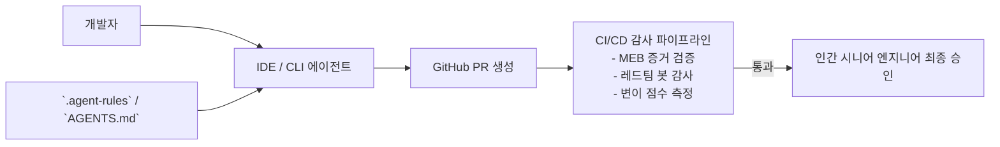

# 제12장: 팀 공통 에이전트 시스템과 CI/CD 파이프라인 연동

---

## 1. 이 장의 결론

> **"개인의 프롬프트 기교는 퇴사하면 사라지지만, '저장소 룰셋과 CI/CD 파이프라인'은 조직의 자산으로 남는다."**  
> 팀 전체가 일관된 품질로 에이전트를 활용하려면, **저장소 레벨 룰셋(`.agent-rules`, `CLAUDE.md`, `AGENTS.md`) 형상 관리**와 **CI/CD 파이프라인의 증거 자동 검증**이 결합되어야 한다.

---

## 2. 이 문제가 중요한 이유

에이전트를 도입한 조직에서 흔히 발생하는 파편화:
- A 엔지니어는 4단 명세를 써서 고품질 코드를 뽑아내는 반면, B 엔지니어는 한 줄짜리 프롬프트로 엉터리 코드를 머지함.
- 프로젝트의 코딩 스타일, 네이밍 컨벤션, 아키텍처 원칙이 에이전트마다 제각각 적용되어 코드베이스가 누더기가 됨.
- 에이전트가 만든 변경사항의 책임자가 누구인지, 어떤 프롬프트와 검증을 거쳤는지 추적(Auditability)할 수 없음.

---

## 3. 핵심 개념

### 3.1 3대 저장소 레벨 규칙 파일 (Repository Rulesets)
1. **아키텍처 및 코딩 컨벤션**: 계층 구조, 네이밍 룰, 사용 금지 라이브러리 목록.
2. **테스트 및 검증 명령 표준**: `test`, `lint`, `typecheck` 실행 명령어 및 필수 옵션.
3. **위험 작업 및 승인 규칙**: 커밋 전 필수 수행 체크리스트.



---

## 4. 잘못된 접근 사례

### 규칙 파일 부재로 인한 컨벤션 파괴
- 새로운 팀원이 합류하여 에이전트에게 "사용자 서비스 구현해줘"라고 지시.
- 에이전트가 팀 표준인 `Result<T, E>` 모나드 패턴 대신 일반 `try-catch throw`를 남발하여 프로젝트 전체의 에러 핸들링 일관성이 깨짐.

---

## 5. 개선된 접근 사례

### `.agent-rules` 형상 관리 및 PR 자동 검증

```markdown
# 🏛️ Team Agent Rules (.agent-rules)

### 1. Error Handling Pattern
- 우리 프로젝트는 절대 원시 Error를 throw하지 않는다.
- 모든 비즈니스 함수는 `Result.ok(value)` 또는 `Result.err(new DomainError())`를 반환해야 한다.

### 2. Forbidden Dependencies
- `moment.js` 대신 `date-fns`를 사용할 것.
- `axios` 대신 내장 `fetch` 또는 `ky`를 사용할 것.

### 3. Commit & PR Standards
- 커밋 메시지는 Conventional Commits 형식을 준수할 것 (`feat:`, `fix:`, `refactor:`).
- PR 본문에는 반드시 [최소 증거 묶음(MEB)] 섹션을 포함할 것.
```

---

## 6. 실제 작업 프롬프트

에이전트가 PR을 생성할 때 작성해야 하는 설명문 프롬프트:

```markdown
작성된 변경사항에 대해 GitHub PR 설명을 생성하십시오.
설명문은 다음 구조를 반드시 포함해야 합니다:

## 1. 변경 요약 (What & Why)
## 2. 작업 위험도 분류 (Tier 1 ~ Tier 4)
## 3. 최소 증거 묶음 (Minimal Evidence Bundle)
- [x] 단위/통합 테스트 실행 결과
- [x] 네거티브/엣지케이스 검증 로그
- [x] 린트 및 타입 검사 무결점
## 4. 변경된 파일 목록 및 Blast Radius (Diff 라인 수)
```

---

## 7. 에이전트가 제출해야 할 증거

- [PR 설명문]: MEB 체크리스트가 완비된 표준 PR 본문.
- [CI 통과 배지]: GitHub Actions 파이프라인 무결점 통과 증적.

---

## 8. 사람이 확인할 사항

- [ ] `.agent-rules`에 정의된 팀 컨벤션이 준수되었는가?
- [ ] PR 설명문에 테스트 실행 로그가 정상적으로 첨부되었는가?

---

## 9. 팀 적용 방법

- **에이전트 룰셋 Git PR 리뷰**: `.agent-rules` 변경 시 팀 전체 테크리드의 리뷰를 거치도록 CODEOWNERS 지정.

---

## 10. 체크리스트

- [ ] 저장소 루트에 `.agent-rules` 또는 동등한 규칙 파일이 존재하는가?
- [ ] CI 파이프라인에서 테스트 커버리지 및 린트 검사가 자동 실행되는가?
- [ ] 에이전트가 생성한 PR에 승인자 및 프롬프트 맥락이 기록되는가?

---

## 11. 연습 문제 및 실습

**과제**: 현재 프로젝트 저장소 루트에 팀의 핵심 아키텍처 규칙과 금지 라이브러리를 명시한 `.agent-rules` 파일을 직접 작성해 보시오.

---

## 12. 참고 자료

- GitHub Documentation: *Creating a Custom Issue and Pull Request Template*.
