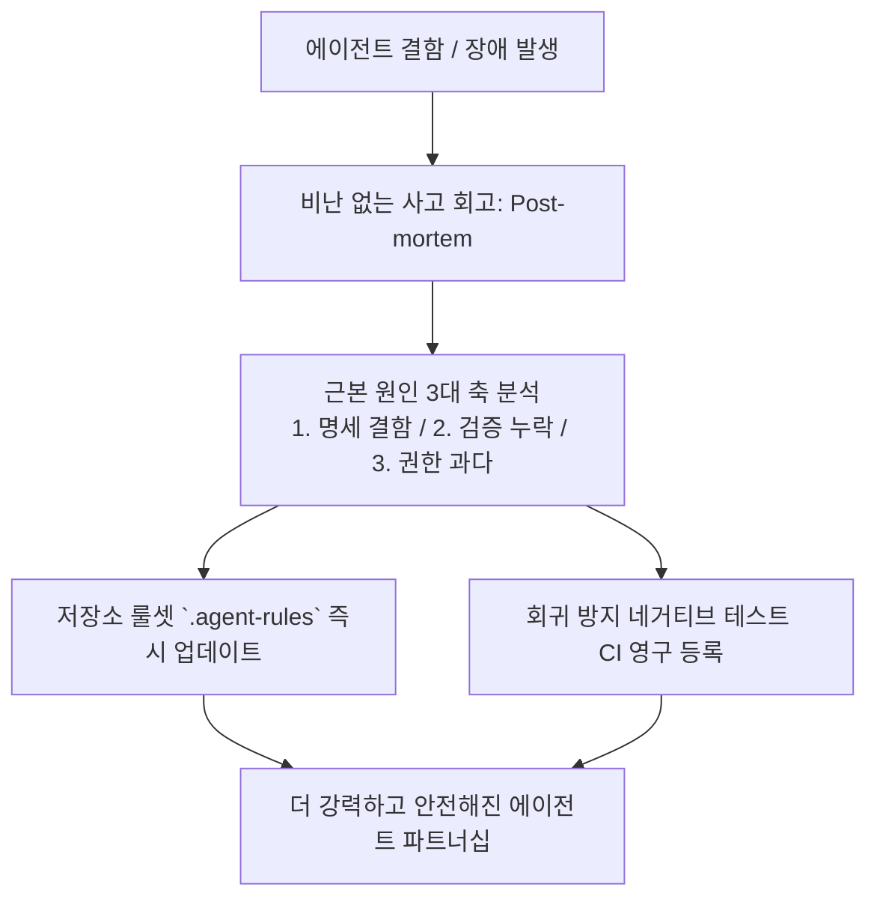

# 제13장: 실패의 자산화와 회고 프레임워크

---

## 1. 이 장의 결론

> **"에이전트의 실수를 비난하지 말고, '시스템 룰셋'을 개선하라."**  
> 진정한 고성능 엔지니어링 팀은 에이전트가 저지른 실패를 **사고 회고록(Post-mortem)**으로 분석하고, 이를 즉시 **저장소 룰셋(`.agent-rules`) 및 테스트 자동화 스위트**로 환류(Feedback Loop)시켜 동일한 실수가 영원히 재발하지 않게 만든다.

---

## 2. 이 문제가 중요한 이유

에이전트를 쓰다 보면 필연적으로 크고 작은 사고(가짜 테스트 머지, N+1 쿼리 유발, 시크릿 노출 등)를 겪게 됩니다.
이때 "AI는 역시 믿을 게 못 돼"라며 개인의 프롬프트 잔소리로 끝내면 조직의 발전은 멈춥니다.
실패를 만났을 때 **"왜 프롬프트 명세가 모호했는가?", "왜 테스트 오라클이 이를 잡지 못했는가?", "어떤 CI 룰을 추가해야 에이전트가 다음번에 이를 피할 수 있는가?"**를 구조적으로 묻고 자산화해야 합니다.

---

## 3. 핵심 개념: 에이전틱 카이젠(Kaizen) 루프



---

## 4. 잘못된 접근 사례

### "사람 탓, AI 탓"으로 끝나는 일회성 질책
- 에이전트가 잘못된 로직을 작성하여 프로덕션 핫픽스를 배포함.
- 개발자가 에이전트 창에 *"너 왜 자꾸 멍청하게 이따위로 코드 짜?"*라고 감정적으로 항의하고 새 세션을 열어버림.
- **결과**: 다음 날 다른 팀원이 동일한 작업을 지시했을 때 똑같은 사고가 정확히 재현됨.

---

## 5. 개선된 접근 사례

### 템플릿 16 기반 사고 회고 및 룰셋 자산화

#### [실제 사고 회고 사례]
- **사건**: 에이전트가 캐시 무효화 없이 DB 업데이트 로직을 수정하여 구버전 데이터 노출 사고 발생.
- **회고 조치**:
  1. `.agent-rules`에 **"캐시가 적용된 엔티티를 수정할 때는 반드시 캐시 무효화(`cache.evict`) 호출 및 해당 단위 테스트를 필수 포함할 것"** 룰 명시.
  2. CI에 캐시 무효화 검증 린트 룰 추가.
  3. 이후 팀 내 모든 엔지니어가 동일 작업을 에이전트에게 시킬 때 에이전트가 자동으로 이 규칙을 읽고 안전하게 구현함.

---

## 6. 실제 작업 프롬프트

사고 발생 시 에이전트와 함께 원인을 분석하는 회고 프롬프트:

```markdown
우리가 방금 겪은 결함에 대해 [비난 없는 엔지니어링 회고(Blameless Post-mortem)]를 수행하십시오.

[분석 관점]
1. 작업 명세서의 어떤 제약조건(Constraints)이 모호했는가?
2. 테스트 단계에서 왜 이 결함이 사전에 감지되지 않았는가 (오라클 누락 원인)?
3. 동일 사고의 재발을 원천 차단하기 위해 `.agent-rules`에 추가해야 할 단 한 줄의 규칙은 무엇인가?
```

---

## 7. 에이전트가 제출해야 할 증거

- [사고 회고록]: 템플릿 16 양식의 포스트모템 문서.
- [룰셋 PR]: `.agent-rules` 수정 및 회귀 방지 테스트 추가 PR.

---

## 8. 사람이 확인할 사항

- [ ] 새로 추가된 룰이 다른 정상 개발 생산성을 저해하지 않는가?
- [ ] 회귀 방지 테스트가 실패하는 것을 확인한 후 통과시켰는가?

---

## 9. 팀 적용 방법

- **스프린트 에이전트 회고 세션**: 격주 스프린트 회고 시 "이번 스프린트에서 에이전트가 겪은 실패와 추가된 룰셋"을 팀원들과 15분간 공유.

---

## 10. 체크리스트

- [ ] 사고 발생 시 감정적 대응 대신 구조적 회고를 수행했는가?
- [ ] 재발 방지책이 문서뿐 아니라 `.agent-rules`와 CI 테스트 코드로 반영되었는가?
- [ ] 룰셋이 팀 공유 저장소에 버전 관리되고 있는가?

---

## 11. 연습 문제 및 실습

**과제**: 최근 프로젝트에서 겪었던 버그 중 하나를 선정하여, 템플릿 16을 작성하고 재발 방지를 위한 `.agent-rules` 문구를 도출해 보시오.

---

## 12. 참고 자료

- Beyer, B., et al. (2016). *Site Reliability Engineering: How Google Runs Production Systems*. O'Reilly. (Blameless Postmortem Culture).
